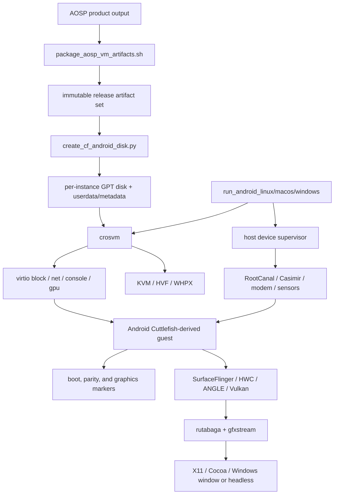
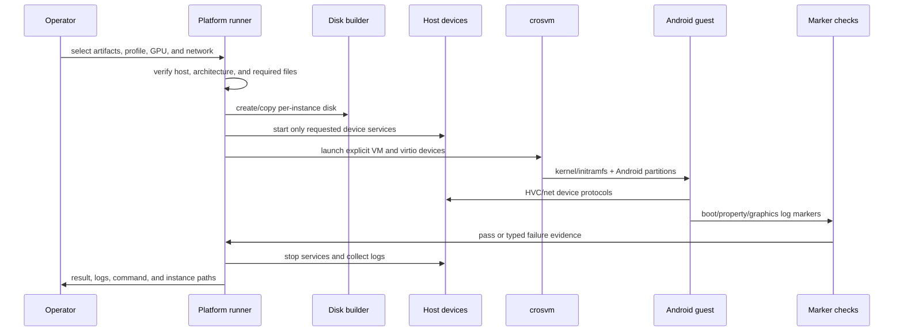
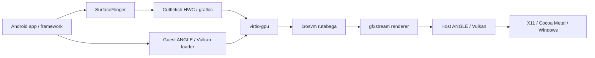

# Full Android / Cuttlefish Cross-Platform Implementation

[简体中文](ANDROID.zh-CN.md) | English

This document is based on the current Android artifact packager, disk builder, three platform
runners, graphics markers, host device daemons, and optional HD integration. Full Android is an
additional compatibility path for framework, graphics, and virtual-device scenarios. It is not the
default security baseline and does not replace the Microdroid release gate.

## 1. Scope and Conclusions

- **Linux/KVM** is the full Android reference path. It covers x86_64/arm64 artifacts, headless and
  GPU modes, two NICs, and the most complete HVC device set.
- **macOS/HVF** targets Apple Silicon, accepts only `vsoc_arm64_only`, and uses Cocoa/Metal, vmnet
  shared NAT, and an arm64 guest.
- **Windows/WHPX** targets x86_64 with PowerShell orchestration and gfxstream/ANGLE/Vulkan.
  `run-mp` is the default; device and HVC capabilities are feature-detected or fail explicitly.
- The platforms share Android partition semantics, virtio devices, the gfxstream stack, and boot
  markers. Their hypervisors, networking, window systems, host IPC, and security isolation are not
  fully equivalent.

The existence of a script or marker means evaluation logic is present. Only target-machine logs,
exit status, and artifact digests establish that a run passed.

## 2. Architecture



The runner does not bring in the complete `launch_cvd` control plane. It selects the necessary
images and host tools from Cuttlefish product output and emits an explicit crosvm command. This
reduces deployment dependencies but makes the scripts responsible for architecture validation,
partition layout, device channels, networking, graphics options, and cleanup.

## 3. Artifacts and Guest Disk

### 3.1 Artifact Packaging

`scripts/package_aosp_vm_artifacts.sh` packages existing AOSP output; it does not build AOSP. The
default products are `vsoc_x86_64` and `vsoc_arm64_only`. A release set contains:

- Android boot, init_boot, vendor_boot, vbmeta, super, userdata, metadata, and related images;
- direct-linux kernel/initramfs when available;
- Microdroid APEX and Soong assets for the smaller guest in the same delivery;
- selected host tools required by launch and validation;
- profile, architecture, file-list, and digest metadata.

The default profile preserves metadata encryption. Disabling it is an explicit development
profile that must be labeled in artifact names, documentation, and release checks.

### 3.2 Aggregate GPT Disk

`scripts/create_cf_android_disk.py` writes a protective MBR and GPT and aligns partitions to 1 MiB.
The layout includes partitions when matching source images exist:

| Partition | Purpose |
| --- | --- |
| `misc` | Boot control and recovery state |
| `boot_a` / `boot_b` | A/B boot images |
| `init_boot_a` / `init_boot_b` | Optional init_boot |
| `vendor_boot_a` / `vendor_boot_b` | Vendor ramdisk and boot configuration |
| `vbmeta_a` / `vbmeta_b` | Top-level AVB metadata |
| `vbmeta_system_a` / `vbmeta_system_b` | System AVB metadata |
| `vbmeta_*_dlkm` | Optional dynamic-kernel-module metadata |
| `super` | Dynamic system/vendor/product logical partitions |
| `userdata` | Per-instance applications and user data |
| `frp` | Factory Reset Protection state |
| `metadata` | File/metadata encryption and early-mount state |

Runtime should create a private per-instance copy or overlay from read-only release sources.
macOS direct-disk mode modifies the source disk and is an explicit development choice; automated
and release runs should use copy mode.

## 4. Launch and Data Flow



## 5. Three-Platform Feature Matrix

| Capability | Linux | macOS | Windows |
| --- | --- | --- | --- |
| Guest product | `vsoc_x86_64` or `vsoc_arm64_only`, matched to host/kernel | `vsoc_arm64_only` only; mixed ABI rejected | `vsoc_x86_64` |
| Hypervisor | KVM | Hypervisor.framework/HVF | WHPX |
| Default resources | 4 CPU / 4 GiB | 4 CPU / 8 GiB | 4 CPU / 8 GiB |
| Run mode | headless or gpu | Cocoa GPU path | `run-mp` by default, or `run` |
| Host display | X11 subwindow/XShm or headless | Cocoa/Metal | Native Windows window or headless |
| Guest graphics | gfxstream + ANGLE/Vulkan; optional guest ANGLE/SwiftShader | gfxstream + ANGLE Metal; arm64 only | gfxstream + ANGLE/Vulkan; optional SwiftShader/custom ICD |
| Host-visible coherent | Optional external blob plus Vulkan host allocation | External blob/udmabuf currently disabled | Optional external blob plus Vulkan host allocation |
| Networking | TAP or crosvm host-IP, two NICs | vmnet shared NAT, two NICs, may need privileges | Two virtio-net devices after build-feature detection |
| Bluetooth/NFC | RootCanal, Casimir, and HVC channels | RootCanal, Casimir, and HVC channels | Native daemons preferred; explicit dev stubs allowed |
| Modem/sensors | Modem daemon; sensors have HVC wiring only | Host-device supervisor serves modem/sensors | Python simulation services enabled by mode and feature |
| Other HVC devices | Full channel layout; each backend needs separate proof | Full channel layout; each backend needs separate proof | Reduced in default `run-mp`; complete with `run`/`FullHvc` |
| Data encryption | Metadata encryption by default; none is dev-only | Same profile semantics | Same profile semantics |
| AVB | Preserved by default; disabling is explicit and development-only | Artifact configuration preserved | Artifact configuration preserved |
| Boot/framework markers | Separate automated checker | Runner produces logs; no equivalent automated checker yet | Separate automated checker |
| Graphics markers | Separate automated checker | No equivalent automated checker yet | Separate automated checker |
| crosvm sandbox | Disabled in current command | Disabled in current command | Disabled in current command |

## 6. Platform Details

### 6.1 Linux/KVM

`scripts/run_android_linux.sh` defaults to
`$AOSP_ROOT/out/target/product/vsoc_x86_64`, CID 100, four CPUs, 4 GiB, and headless mode. GPU mode
can select host ANGLE/Vulkan with gfxstream, guest ANGLE, SwiftShader, host-visible coherent memory
using external blobs and `VulkanAllocateHostMemory`, and X11 subwindow/XShm scanout.

The script filters and validates fstab, permits one selected filesystem configuration, and requires
`/system`, `/data`, and `/metadata` mount semantics. Networking uses explicit TAP devices or
crosvm host-IP configuration and exposes two virtio-net devices. RootCanal, Casimir, modem, and
other host daemons start only when requested.

### 6.2 macOS/HVF

`scripts/run_android_macos.sh` requires macOS, Apple Silicon, and `vsoc_arm64_only`. It rejects an
x86_64 guest or mixed ABI instead of attempting binary translation. Graphics use gfxstream,
`crosvm-angle`, ANGLE Metal, and Cocoa input/windowing; external blobs and udmabuf are disabled.

Two NICs use vmnet shared NAT. Missing system privileges or entitlement must be reported rather
than treated as working networking. A host-device supervisor manages RootCanal, Casimir, modem,
and sensors. The script supports copied or direct disks; direct mode carries source-artifact write
risk.

### 6.3 Windows/WHPX

`scripts/run_android_windows_gfxstream_angle.ps1` defaults to an x86_64 Cuttlefish product, four
CPUs, 8 GiB, and `run-mp`. The artifact directory can be passed explicitly; any machine-local
default in the script is only a development convenience and must not enter portable release
configuration.

Graphics support gfxstream with ANGLE/Vulkan, SwiftShader, a custom ICD, and optional external
blobs with `VulkanAllocateHostMemory`. `ConservativeWhpx` reduces the VM to one CPU and one block
queue for WHPX diagnosis; it is not a normal performance profile.

Two virtio-net devices are enabled after crosvm feature detection. RootCanal/Casimir prefer native
daemons; only a development flow with explicit `AllowDeviceStubs` may use stubs. Base `run-mp` has
a reduced HVC set, while `run` or `FullHvc` enables the complete channel layout. A successful boot
therefore does not demonstrate equal device coverage between modes.

## 7. Graphics Implementation



Graphics validation requires more than a visible window. Linux/Windows marker logic checks
SurfaceFlinger `Boot finished`, ANGLE Vulkan and GuestVulkanOnly selection, gfxstream renderer
initialization, `VkDevice` creation, scanout and frame flush, and rejects EGL/Vulkan initialization
errors and SurfaceFlinger/system_server crashes.

The macOS runner retains crosvm and guest logs but currently has no matching automated marker
checker. A macOS release run must apply equivalent checks on target-machine evidence; a visible
Cocoa window alone is not a passing graphics gate.

Linux and Windows host-visible coherent mode requires external blobs and host memory allocation
together; one accepted parameter is not proof of zero-copy behavior. macOS explicitly disables
that path and must be evaluated using its actual Metal/Cocoa copy and scanout semantics.

## 8. Virtual Devices and HVC Channels

The full layout below is mode- and feature-dependent:

| HVC | Purpose |
| --- | --- |
| `hvc0` | Guest console |
| `hvc1` | Sink/reserved |
| `hvc2` | logcat |
| `hvc3` | keymaster |
| `hvc4` | gatekeeper |
| `hvc5` | Bluetooth/RootCanal |
| `hvc6` / `hvc7` | Sink/legacy reserved |
| `hvc8` | Confirmation UI |
| `hvc9` | UWB |
| `hvc10` | OEM lock |
| `hvc11` | KeyMint |
| `hvc12` | NFC/Casimir |
| `hvc13` | Sensors |
| `hvc14` | MCU control |
| `hvc15` | MCU UART |

HVC files and sockets should be private per instance. A channel without a host daemon must not be
reported as a working feature. Development stubs prove protocol wiring and startup tolerance, not
real Bluetooth, UWB, NFC, modem, or sensor behavior.

## 9. Guest, Framework, and Feature Gates

The Linux/Windows automated boot gate requires at least `sys.boot_completed=1` and no fatal
critical system process. Full parity checks include framework markers such as
`PersistentDataBlockService` and `OnBootPhase_1000` and reject radio/device errors. GPU modes add
the graphics markers in section 7. macOS currently supplies log collection only, so the same checks
remain target-host validation steps there.

Evidence should be separated into these levels:

1. **Boot**: kernel, initramfs, partitions, init, and boot completed.
2. **Framework**: system_server phase, PackageManager, persistent data block, and critical services.
3. **Graphics**: SurfaceFlinger, HWC, ANGLE/Vulkan, scanout, and frame flush.
4. **Devices**: each host daemon, HVC, guest HAL, and an observable operation.
5. **Networking**: two-NIC addressing, routes, DNS, guest-to-host, and controlled external access.
6. **Persistence**: userdata/metadata, encryption state, and isolation after restart.
7. **Cleanup**: crosvm/daemon exit, TAP/vmnet/pipe/socket cleanup, and log archival.

## 10. Source Change Map

| Repository | Full Android changes |
| --- | --- |
| Root repository | Artifact packaging, GPT disk creation, platform runners, graphics/boot markers, host-daemon lifecycle, logging, and regression orchestration |
| `external/crosvm` | KVM/HVF/WHPX, virtio block/net/gpu/console, vmnet, Cocoa/Windows display, named pipes, and portable input |
| `external/gfxstream` | Host display selection, Windows frame bridge, macOS/Windows recorder, coherent memory, and display telemetry |
| `frameworks/native` | Host Binder/IPC portability shared by the control plane and tools |
| AOSP product artifacts | Cuttlefish guest kernel, ramdisk, super, AVB, fstab, HAL, and framework configuration, built in an external AOSP workspace |

The `hd-feature` branch also contains a separate `hd/` product integration with instance workers,
leases, ADB, frame output, and device adapters. It is not part of the main-branch baseline. On that
branch see `hd/docs/AOSP_MICRODROID_FEATURE_ALIGNMENT.md`,
`hd/docs/AOSP_ANDROID_FEATURE_ALIGNMENT.md`, and `hd/docs/ARCHITECTURE.md`. Its importer should
receive already built and verified compatibility artifacts, not implicit build-host state.

## 11. Security and Isolation Review

Implemented baseline controls include separation of immutable sources and writable instance
state, pre-launch partition and architecture checks, AVB and metadata encryption by default,
on-demand host daemons, per-instance disks/logs/endpoints/CIDs, and archivable commands and markers.

Current limitations are explicit:

- All three runners currently include `--disable-sandbox` in the crosvm command. VM isolation
  remains, but a complete VMM host-process sandbox cannot be claimed.
- macOS HVF and Windows WHPX do not provide Android pKVM/pVM-equivalent guarantees. The full
  Android path is not a protected-VM certification path.
- Graphics, network, input, and host device daemons expand the attack surface. Production profiles
  should enable only required devices and constrain host listeners.
- Disabling AVB or metadata encryption, enabling debug console/ADB, allowing device stubs, or
  modifying a release disk directly are explicit development-only choices.
- Boot success is not application, HAL, security, or performance parity; each capability needs
  independent evidence.

## 12. Run Entry Points

First package existing output from an AOSP workspace:

```bash
./scripts/package_aosp_vm_artifacts.sh --help
```

Linux:

```bash
./scripts/run_android_linux.sh --help
./scripts/run_android_linux.sh
```

macOS:

```bash
./scripts/run_android_macos.sh --help
./scripts/run_android_macos.sh
```

Windows:

```powershell
Get-Help .\scripts\run_android_windows_gfxstream_angle.ps1 -Full
.\scripts\run_android_windows_gfxstream_angle.ps1 -ArtifactDir <artifact-directory>
```

Current script help is authoritative for parameters and defaults. Release orchestration should
pass product, artifact directory, profile, GPU, network, and instance directory explicitly instead
of relying on developer-machine defaults.

## 13. Release Checklist

- Host/guest/product architectures match, with a retained SHA-256 manifest.
- Release sources are read-only; userdata, metadata, FRP, logs, and endpoints are per-instance.
- AVB, encryption, and debug state match the named release profile.
- Hypervisor capability, crosvm/gfxstream version, and full launch command are captured per host.
- Boot, framework, graphics, devices, network, persistence, and cleanup pass independently.
- Stubs, marker source presence, and a single visible frame are not reported as full parity.
- `--disable-sandbox`, pVM gaps, and every enabled host attack surface are recorded.
- Microdroid regression passes independently; full Android success cannot replace it.

## 14. Code Entry Points

- Artifact packager: [package_aosp_vm_artifacts.sh](../scripts/package_aosp_vm_artifacts.sh)
- GPT disk builder: [create_cf_android_disk.py](../scripts/create_cf_android_disk.py)
- Linux: [run_android_linux.sh](../scripts/run_android_linux.sh)
- macOS: [run_android_macos.sh](../scripts/run_android_macos.sh)
- Windows: [run_android_windows_gfxstream_angle.ps1](../scripts/run_android_windows_gfxstream_angle.ps1)
- Short guide: [Cuttlefish compatibility path](CUTTLEFISH.md)
- Primary guest: [Microdroid cross-platform implementation](MICRODROID.md)
