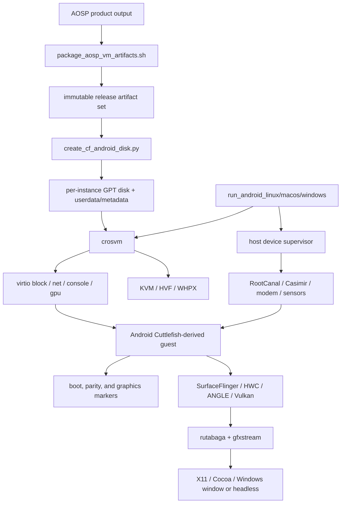
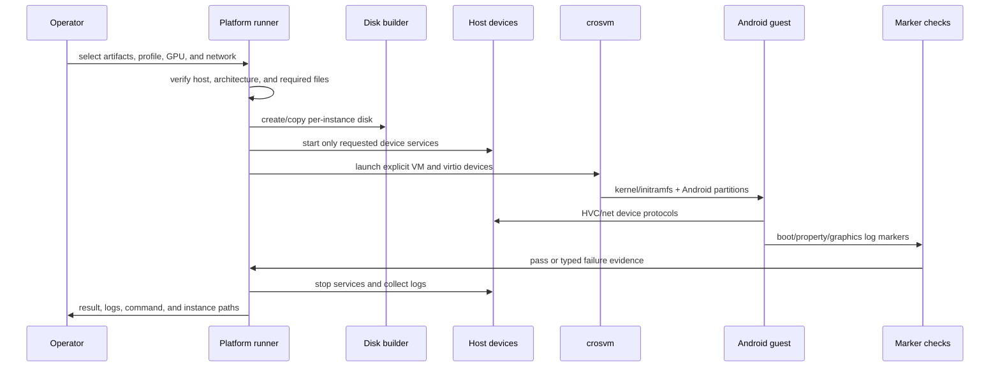
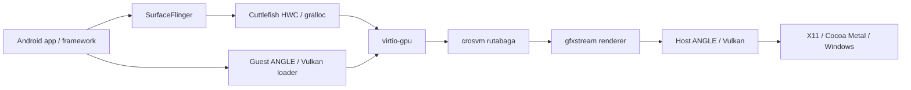

# 完整 Android / Cuttlefish 跨平台实现详解

简体中文 | [English](ANDROID.md)

本文基于当前仓库的 Android 制品打包、磁盘生成、三平台启动器、图形 marker、设备守护进程
和可选 HD 集成代码整理。完整 Android 是 Microdroid 之外的附带兼容路径，用于 Framework、
图形和虚拟设备场景；它不是默认安全基线，也不能替代 Microdroid 发布门禁。

## 1. 范围与结论

- **Linux/KVM** 是完整 Android 的参考路径，覆盖 x86_64/arm64 制品、无头与 GPU 模式、双网卡
  和较完整的 HVC 设备集合。
- **macOS/HVF** 面向 Apple Silicon，只接受 `vsoc_arm64_only`，使用 Cocoa/Metal、vmnet shared
  NAT 和 arm64 Guest。
- **Windows/WHPX** 面向 x86_64，使用 PowerShell 编排和 gfxstream/ANGLE/Vulkan；`run-mp` 是
  默认执行模式，设备和 HVC 能力按实际构建特性降级或显式失败。
- 三个平台共享 Android 分区语义、virtio 设备模型、gfxstream 图形栈和启动 marker，但
  hypervisor、网络、窗口系统、Host IPC 和安全隔离并不完全等价。

本文中的“有脚本/有 marker”表示仓库具备执行和判定逻辑；只有目标机器产生的日志、退出码
和制品摘要才是运行通过证据。

## 2. 系统架构



运行器不调用完整的 `launch_cvd` 管理面，而是从 Cuttlefish 产品制品中选择必要镜像与 host
工具，构造显式 crosvm 命令。这减少了部署依赖，但也使脚本本身承担产品架构检查、分区布局、
设备通道、网络、图形参数和清理职责。

## 3. 制品与 Guest 磁盘

### 3.1 制品打包

`scripts/package_aosp_vm_artifacts.sh` 打包已经存在的 AOSP 输出，不负责构建 AOSP。默认产品
范围是 `vsoc_x86_64` 与 `vsoc_arm64_only`。发布包包含：

- boot、init_boot、vendor_boot、vbmeta、super、userdata、metadata 等 Android 镜像；
- 可用时的 direct-linux kernel/initramfs；
- Microdroid APEX 与 Soong 相关资源，供同一交付集的精简 Guest 使用；
- 启动与验证所需的选定 host 工具；
- profile、架构、文件列表和摘要等元数据。

默认 profile 保持 metadata encryption。显式关闭加密只能作为开发 profile，必须在名称、
文档和发布检查中标注，不能与生产候选制品混用。

### 3.2 GPT 聚合磁盘

`scripts/create_cf_android_disk.py` 生成带 protective MBR 与 GPT 的聚合磁盘，并按 1 MiB
边界对齐。分区按源制品存在情况组成：

| 分区 | 用途 |
| --- | --- |
| `misc` | 启动控制与 recovery 状态 |
| `boot_a` / `boot_b` | A/B boot 镜像 |
| `init_boot_a` / `init_boot_b` | 可选 init_boot |
| `vendor_boot_a` / `vendor_boot_b` | vendor ramdisk/boot 配置 |
| `vbmeta_a` / `vbmeta_b` | 顶层 AVB metadata |
| `vbmeta_system_a` / `vbmeta_system_b` | system AVB metadata |
| `vbmeta_*_dlkm` | 可选动态内核模块 metadata |
| `super` | 动态 system/vendor/product 等逻辑分区 |
| `userdata` | 实例应用和用户数据 |
| `frp` | Factory Reset Protection 状态 |
| `metadata` | 文件/metadata 加密与早期挂载状态 |

运行时应从只读发布源创建每实例私有副本或 overlay。macOS 的 direct-disk 模式会修改源磁盘，
属于显式开发选择；自动化和发布运行应使用复制模式。

## 4. 启动和数据流



## 5. 三平台功能对齐矩阵

| 能力 | Linux | macOS | Windows |
| --- | --- | --- | --- |
| Guest 产品 | `vsoc_x86_64` 或 `vsoc_arm64_only`，需匹配 host/内核 | 仅 `vsoc_arm64_only`，拒绝混合 ABI | `vsoc_x86_64` |
| Hypervisor | KVM | Hypervisor.framework/HVF | WHPX |
| 默认资源 | 4 CPU / 4 GiB | 4 CPU / 8 GiB | 4 CPU / 8 GiB |
| 运行模式 | headless 或 gpu | Cocoa GPU 路径 | `run-mp` 默认，或 `run` |
| Host 显示 | X11 subwindow/XShm 或无头 | Cocoa/Metal | 原生 Windows 窗口或无头 |
| Guest 图形 | gfxstream + ANGLE/Vulkan；可选 guest ANGLE/SwiftShader | gfxstream + ANGLE Metal；固定 arm64 | gfxstream + ANGLE/Vulkan；可选 SwiftShader/custom ICD |
| Host-visible coherent | 可选 external blob + Vulkan host allocation | 当前关闭 external blob/udmabuf | 可选 external blob + Vulkan host allocation |
| 网络 | TAP 或 crosvm host-IP，双 NIC | vmnet shared NAT，双 NIC，可能需要管理员权限 | 构建特性探测后启用双 virtio-net |
| 蓝牙/NFC | RootCanal + Casimir + 对应 HVC | RootCanal + Casimir + 对应 HVC | 优先原生 daemon；开发时可显式允许 stub |
| Modem/Sensors | modem daemon；sensors 仅 HVC 接线 | host device supervisor 提供 modem/sensors | Python 模拟服务；按模式和特性启用 |
| 其他 HVC 设备 | 完整通道布局，是否有后端需逐项证明 | 完整通道布局，是否有后端需逐项证明 | `run-mp` 默认精简，`run`/`FullHvc` 才完整 |
| 数据加密 | 默认 metadata encryption；none 仅开发 | 同一 profile 语义 | 同一 profile 语义 |
| AVB | 默认保持；禁用需显式开发开关 | 保持制品配置 | 保持制品配置 |
| 启动/Framework marker | 有独立自动检查脚本 | runner 产生日志，尚无等价自动检查器 | 有独立自动检查脚本 |
| 图形 marker | 有独立自动检查脚本 | 尚无等价自动检查器 | 有独立自动检查脚本 |
| crosvm sandbox | 当前启动命令禁用 | 当前启动命令禁用 | 当前启动命令禁用 |

## 6. 平台实现细节

### 6.1 Linux/KVM

`scripts/run_android_linux.sh` 默认使用
`$AOSP_ROOT/out/target/product/vsoc_x86_64`、CID 100、4 CPU、4 GiB 与 headless 模式。
GPU 模式可选择：

- Host ANGLE/Vulkan + gfxstream；
- Guest ANGLE；
- SwiftShader 软件渲染；
- external blob 与 `VulkanAllocateHostMemory` 的 host-visible coherent 路径；
- X11 subwindow 与 XShm scanout。

脚本过滤并验证 fstab，只允许单一选择的文件系统配置，并要求 `/system`、`/data`、
`/metadata` 挂载语义存在。网络可使用显式 TAP，也可让 crosvm 配置 host-IP；两张 virtio-net
卡与 Cuttlefish 语义对齐。RootCanal、Casimir、modem 等 host daemon 只在需要时启动。

### 6.2 macOS/HVF

`scripts/run_android_macos.sh` 强制 macOS、Apple Silicon 和 `vsoc_arm64_only`。发现 x86_64
Guest 或混合 ABI 时立即失败，不尝试二进制翻译。图形使用 gfxstream、`crosvm-angle`、ANGLE
Metal 和 Cocoa 输入/窗口；当前关闭 external blob 与 udmabuf。

两张网卡通过 vmnet shared NAT 实现；系统权限或 entitlement 不满足时必须报告，而不能假装
网络已经对齐。RootCanal、Casimir、modem 与 sensors 由 host device supervisor 管理。脚本
允许复制磁盘或直接使用源磁盘，后者会产生源制品写入风险。

### 6.3 Windows/WHPX

`scripts/run_android_windows_gfxstream_angle.ps1` 默认使用 x86_64 Cuttlefish 制品、4 CPU、
8 GiB 和 `run-mp`。制品路径可显式指定；脚本中的本机默认目录只是开发便利值，不能写进可
移植发布配置。

图形支持 gfxstream + ANGLE/Vulkan、SwiftShader、自定义 ICD，以及可选 external blob 和
`VulkanAllocateHostMemory`。`ConservativeWhpx` 会缩减为单 CPU/单 block queue，用于诊断
WHPX 兼容问题，不代表正常性能配置。

网络通过 crosvm 编译特性探测后启用双 virtio-net。RootCanal/Casimir 优先使用原生 daemon；
只有显式 `AllowDeviceStubs` 的开发流程可以使用 stub。`run-mp` 基础模式使用精简 HVC 集，
`run` 或 `FullHvc` 才启用完整设备通道，因此模式之间不能只比较“Guest 启动成功”。

## 7. 图形实现



图形链不仅要求窗口出现，还要验证 Guest 与 Host 两侧协商。Linux/Windows 的自动检查逻辑
覆盖：

- SurfaceFlinger `Boot finished`；
- ANGLE Vulkan 与 GuestVulkanOnly 选择；
- gfxstream renderer 初始化；
- `VkDevice` 创建、scanout 与 frame flush；
- EGL/Vulkan 初始化错误、SurfaceFlinger/system_server crash 等否定 marker。

macOS runner 会保存 crosvm 与 Guest 日志，但当前没有对应的自动 marker checker。发布验证
必须在 macOS 实机上按相同语义补齐检查，不能把 Cocoa 窗口出现当作图形门禁通过。

Linux/Windows 的 host-visible coherent 路径依赖 external blob 和 host memory allocation 同时
满足，不能单独打开一个参数后声明零拷贝已实现。macOS 当前明确关闭这一路径，应按 Metal/
Cocoa 的实际 copy/scanout 语义评估。

## 8. 虚拟设备与 HVC 通道

完整 HVC 布局如下；实际启用集合取决于平台模式和编译特性：

| HVC | 用途 |
| --- | --- |
| `hvc0` | Guest console |
| `hvc1` | sink/reserved |
| `hvc2` | logcat |
| `hvc3` | keymaster |
| `hvc4` | gatekeeper |
| `hvc5` | Bluetooth/RootCanal |
| `hvc6` / `hvc7` | sink/legacy reserved |
| `hvc8` | confirmation UI |
| `hvc9` | UWB |
| `hvc10` | OEM lock |
| `hvc11` | KeyMint |
| `hvc12` | NFC/Casimir |
| `hvc13` | sensors |
| `hvc14` | MCU control |
| `hvc15` | MCU UART |

HVC 文件或 socket 应按实例隔离。没有 host daemon 的通道不应被报告为功能可用；开发 stub
只能证明协议接线与启动容错，不能证明真实蓝牙、UWB、NFC、modem 或传感器行为。

## 9. Guest、Framework 与功能门禁

Linux/Windows 自动门禁的基础启动要求至少包括 `sys.boot_completed=1`，且不得出现关键
system process 致命失败。完整功能对齐还检查 `PersistentDataBlockService`、
`OnBootPhase_1000` 等 Framework marker，并拒绝 radio/device 相关异常。图形模式额外执行
第 7 节 marker。macOS 目前只有日志产出路径，以下同等检查仍需作为目标机验证步骤执行。

建议将证据拆为以下层次：

1. **Boot**：kernel、initramfs、分区挂载、init 与 boot completed。
2. **Framework**：system_server boot phase、PackageManager、持久数据块与关键服务。
3. **Graphics**：SurfaceFlinger、HWC、ANGLE/Vulkan、scanout 和 frame flush。
4. **Devices**：每个 host daemon、对应 HVC、Guest HAL 与可观察操作。
5. **Networking**：双 NIC 地址、路由、DNS、Guest→Host 与受控外网连通。
6. **Persistence**：重启后 userdata/metadata、加密状态和实例隔离。
7. **Cleanup**：crosvm/daemon 退出、TAP/vmnet/pipe/socket 回收和日志归档。

## 10. 代码修改分布

| 仓库 | 与完整 Android 相关的修改 |
| --- | --- |
| 根仓库 | 制品打包、GPT 磁盘生成、三平台 runner、图形/启动 marker、host daemon 生命周期、日志与回归编排 |
| `external/crosvm` | KVM/HVF/WHPX、virtio block/net/gpu/console、vmnet、Cocoa/Windows display、named pipe 与多平台输入 |
| `external/gfxstream` | Host display selection、Windows frame bridge、macOS/Windows recorder、coherent memory 与 display telemetry |
| `frameworks/native` | Host Binder/IPC portability，为共享控制面和工具提供跨平台基础 |
| AOSP product artifacts | Cuttlefish Guest kernel、ramdisk、super、AVB、fstab、HAL 与 Framework 配置；由外部 AOSP 构建产生 |

`hd-feature` 分支还有独立的 `hd/` 产品集成，以及更细的实例 worker、lease、ADB、帧输出和
设备适配。它不属于主分支基线；在该分支查看
`hd/docs/AOSP_MICRODROID_FEATURE_ALIGNMENT.md`、
`hd/docs/AOSP_ANDROID_FEATURE_ALIGNMENT.md` 与 `hd/docs/ARCHITECTURE.md`。导入脚本只应接收
已经构建并验证的兼容制品，不应把 AOSP 构建机状态隐式带入发布实例。

## 11. 安全与隔离审查

### 已实现的基础控制

- 发布源镜像与每实例可写状态分离；分区和 Guest 架构在启动前验证。
- AVB 与 metadata encryption 默认保留，禁用需要显式开发开关。
- host device daemon 按需启动，日志、socket/pipe、磁盘与 CID 可按实例分离。
- 启动命令、marker、退出状态和 daemon 日志可归档形成审计材料。

### 当前限制

- 三平台 runner 构造的 crosvm 命令当前包含 `--disable-sandbox`。Guest 的 VM 隔离仍存在，
  但不能宣称 VMM host 进程已有完整沙箱。
- macOS HVF 和 Windows WHPX 不提供 Android pKVM/pVM 等价保证；完整 Android 路径也不是
  protected-VM 认证路径。
- 图形、网络、剪贴板/输入和 host device daemon 都扩大攻击面。生产 profile 应只启用业务
  必需设备并限制 host 监听地址。
- 禁用 AVB、关闭 metadata encryption、启用调试 console/ADB、允许 device stub 或直接写
  发布磁盘，均只能作为显式开发配置。
- 启动成功不等于应用、HAL、安全或性能对齐；每一能力需独立证据。

## 12. 运行入口

先在 AOSP 工作区打包既有制品：

```bash
./scripts/package_aosp_vm_artifacts.sh --help
```

Linux：

```bash
./scripts/run_android_linux.sh --help
./scripts/run_android_linux.sh
```

macOS：

```bash
./scripts/run_android_macos.sh --help
./scripts/run_android_macos.sh
```

Windows：

```powershell
Get-Help .\scripts\run_android_windows_gfxstream_angle.ps1 -Full
.\scripts\run_android_windows_gfxstream_angle.ps1 -ArtifactDir <artifact-directory>
```

参数和默认值以当前脚本帮助为准；发布编排应显式传入产品、制品目录、profile、GPU、网络和
实例目录，不依赖开发机默认路径。

## 13. 发布检查表

- 制品架构与 Host/Guest 组合匹配，并保存 SHA-256 清单。
- 发布源只读；userdata、metadata、FRP、日志和控制端点按实例隔离。
- AVB、加密和调试状态与发布 profile 一致。
- 对每个平台保存 hypervisor 能力、crosvm/gfxstream 版本和完整启动命令。
- Boot、Framework、Graphics、Devices、Network、Persistence、Cleanup 分层通过。
- 没有把 stub、marker 代码存在或单次窗口显示当作功能完全对齐。
- 明确记录 `--disable-sandbox`、pVM 不对齐和启用的 host attack surface。
- Microdroid 回归独立通过；完整 Android 成功不能替代它。

## 14. 关键入口

- 制品打包：[package_aosp_vm_artifacts.sh](../scripts/package_aosp_vm_artifacts.sh)
- 打包流程：[AOSP 产物打包说明](AOSP_ARTIFACT_PACKAGING.zh-CN.md)
- GPT 磁盘：[create_cf_android_disk.py](../scripts/create_cf_android_disk.py)
- Linux：[run_android_linux.sh](../scripts/run_android_linux.sh)
- macOS：[run_android_macos.sh](../scripts/run_android_macos.sh)
- Windows：[run_android_windows_gfxstream_angle.ps1](../scripts/run_android_windows_gfxstream_angle.ps1)
- 精简说明：[Cuttlefish 兼容路径](CUTTLEFISH.zh-CN.md)
- Microdroid 主路径：[Microdroid 跨平台实现](MICRODROID.zh-CN.md)
