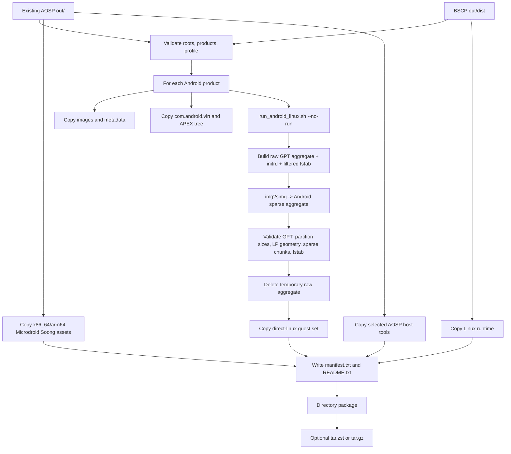

# AOSP Artifact Packaging Workflow

[简体中文](AOSP_ARTIFACT_PACKAGING.zh-CN.md) | English

This document explains how [package_aosp_vm_artifacts.sh](../scripts/package_aosp_vm_artifacts.sh)
organizes existing AOSP products, Microdroid guest assets, and the BSCP Linux host runtime into a
transportable and verifiable directory package. It reflects current script behavior and
distinguishes file collection, structural validation, and release readiness.

> The packager does not run `repo sync`, clean AOSP, or perform a full AOSP build. It consumes
> existing output and regenerates a direct-boot aggregate disk for full Android. Build provenance,
> configuration, and reproducibility must be established before packaging.

## 1. Purpose and Boundary

The workflow collects three content classes:

1. **Full Android/Cuttlefish guest**: product images and metadata, direct-linux kernel/initrd, a
   filtered fstab, and an Android-sparse GPT aggregate disk.
2. **Microdroid guest**: `com.android.virt` APEX content, the product APEX runtime tree, and x86_64
   and arm64 Soong intermediates.
3. **Host runtime**: the current BSCP Linux x86_64 runtime and a selected subset of AOSP host tools
   found in the workspace.

This is not a complete four-platform installer. `host/linux-x86_64` contains only the Linux host
runtime. macOS and Windows host binaries must be built and delivered on their respective platforms.
Guest assets can be consumed by different hosts when CPU architecture and the guest ABI match.

## 2. Pipeline Overview



## 3. Input Directories

Defaults are derived from the root repository location:

| Option/environment | Default | Purpose |
| --- | --- | --- |
| `--aosp-root` / `AOSP_ROOT` | `../aosp` | A previously built AOSP workspace |
| `--dist-root` | `out/dist` | Previously built BSCP host runtime |
| `--output-root` / `OUTPUT_ROOT` | `out/packages` | Directory-package and archive root |
| `--package-name` | Timestamped name | Output directory name |
| `--products` | `vsoc_x86_64,vsoc_arm64_only` | Android products to collect |

Each selected product must exist at:

```text
<aosp-root>/out/target/product/<product>/
```

The script also consumes:

- `out/host/linux-x86/bin/`: `img2simg`, `simg2img`, `adb`, `avbtool`, `lpmake`, and related tools;
- `out/host/linux_musl-arm64/bin/adb`: the arm64 Linux ADB when present;
- `out/soong/.intermediates/packages/modules/Virtualization/build/microdroid/`: Microdroid kernel,
  initrd, super, vbmeta, JSON, and fstab intermediates for both architectures;
- product `apex/`, `system/apex/`, `system_ext/apex/`, and `vendor/apex/`: the Microdroid host APEX
  runtime tree.

## 4. AOSP Build Prerequisites

The packager does not build AOSP. Build with the project's pinned manifest, branch, product
configuration, and toolchain, and make sure the product directory does not mix outputs from
different baselines or lunch configurations. The following illustrates the boundary; it does not
promise a universal lunch name for every AOSP branch:

```bash
cd /absolute/path/to/aosp
source build/envsetup.sh
lunch <project-selected-product>-userdebug
m -j"$(nproc)" droid dist
```

The default ARM product is `vsoc_arm64_only` because Apple Silicon/HVF cannot directly execute the
AArch32 userspace in mixed-ABI `vsoc_arm64`. At minimum, confirm the presence of:

- `kernel`, `ramdisk.img`, `vendor_ramdisk.img`, and `vendor-bootconfig.img`;
- `boot.img`, `vendor_boot.img`, `vbmeta.img`, and `vbmeta_system.img`;
- `super.img`, `userdata.img`, and `misc_info.txt`;
- `vendor/etc/fstab.cf.f2fs.hctr2`;
- AOSP host `lz4`, `img2simg`, and `simg2img`.

Microdroid packaging also requires the matching `com.android.virt` APEX and Microdroid Soong
targets. Some copy helpers silently skip absent optional files, so successful script completion
alone does not prove that the Microdroid set is complete.

## 5. Host Tool Prerequisites

The packaging workflow targets a Linux shell environment and depends on:

- Bash, GNU `cp` with `-L --sparse=always`, `rsync`, `sed`, `awk`, `find`, `file`, `tar`, `du`, and
  coreutils;
- Python 3, `cpio`, and `mkfs.ext4`;
- AOSP host `lz4`, `img2simg`, and `simg2img`;
- optional `zstd`; archive creation falls back to gzip when it is absent;
- `out/dist/linux/bin/crosvm`, built with the features needed by direct Android.

Although the internal `run_android_linux.sh --no-run` call does not launch a guest, the current
runner still probes networking features and prepares Cuttlefish TAP devices unless networking is
explicitly disabled. The packager currently does not pass `--no-network`, so execution may require
`sudo` or network-device permission and may leave reusable TAP devices. This is current behavior,
not a permission-free file-copy operation.

## 6. Recommended Commands

Build the BSCP Linux runtime first, then use explicit absolute directories and a unique package
name:

```bash
./build_all.sh

./scripts/package_aosp_vm_artifacts.sh \
  --aosp-root /absolute/path/to/aosp \
  --dist-root /absolute/path/to/bscp/out/dist \
  --output-root /absolute/path/to/release-staging \
  --package-name bscp-vm-artifacts-release-candidate \
  --products vsoc_x86_64,vsoc_arm64_only \
  --data-encryption metadata \
  --archive
```

To package one product:

```bash
./scripts/package_aosp_vm_artifacts.sh \
  --aosp-root /absolute/path/to/aosp \
  --package-name bscp-vm-artifacts-x86_64 \
  --products vsoc_x86_64 \
  --data-encryption metadata
```

`PACKAGE_DIR=<output-root>/<package-name>` is recursively deleted and recreated at startup. Do not
point `--package-name` at an existing release directory, and do not derive it from unchecked input
or a broad path.

## 7. Data-Encryption Profiles

| Option | Default fstab suffix | Meaning | Release use |
| --- | --- | --- | --- |
| `--data-encryption metadata` | `cf.f2fs.hctr2` | Requires metadata-encryption flags on `/data` | Default release-candidate profile |
| `--data-encryption none` | `dev.direct` | Removes encryption flags and mounts `/data` in first stage | Compatibility development only; no at-rest protection claim |

`--fstab-suffix` may override the suffix and accepts only letters, digits, dots, underscores, and
hyphens. A custom suffix must match bootconfig and guest fstab selection. The `none` profile is not
a degraded substitute for metadata encryption, and nonsecure KeyMint cannot establish
production-grade key protection.

## 8. Per-Product Android Processing

### 8.1 Collect Product Files

Top-level `*.img` files, kernel variants, and the bootloader are copied to `images/`.
`android-info.txt`, `misc_info.txt`, build fingerprints, required-images and installed-files lists,
`module-info.json`, and related metadata go to `meta/`. Copies follow symbolic links and preserve
sparse file layout where possible.

### 8.2 Create Direct-Boot Inputs

The packager invokes `run_android_linux.sh --no-run`. The runner:

1. selects one dynamic-partition filesystem type;
2. filters and validates the Android fstab for the selected encryption profile;
3. creates a 64 MiB `misc`, 64 MiB ext4 `metadata`, and 1 MiB FRP helper image when each file is
   absent;
4. combines ramdisk, vendor ramdisk, the additional fstab cpio, and bootconfig into
   `initrd_android.img`;
5. calls `create_cf_android_disk.py` to write a protective MBR plus primary and backup GPT to a raw
   aggregate disk;
6. creates HVC input files but, because of `--no-run`, starts neither crosvm nor device daemons.

The runner reuses existing misc, metadata, and FRP files. Before packaging, ensure the root
repository's `out/android-linux` and `out/android-linux-<product>` are dedicated, clean staging
state; otherwise prior boot, encryption, or FRP state can enter the aggregate and release package.

The GPT is aligned to 1 MiB and includes, when source images exist, misc, A/B boot, init_boot,
vendor_boot, vbmeta, vbmeta_system, optional DLKM vbmeta, super, userdata, FRP, and metadata
partitions. See [Full Android Implementation](ANDROID.md) for partition semantics.

### 8.3 Convert and Validate

AOSP `img2simg` converts raw `aggregate_android.img` to
`aggregate_android.sparse.img`. The embedded Python validator then checks:

- the raw disk's `EFI PART` GPT header, partition extents, and required `super` and `userdata`;
- exact `super` and `userdata` partition sizes against `misc_info.txt`;
- that `super` is expanded rather than nested Android sparse data and contains valid LP metadata
  geometry;
- sparse header, chunk type and size, logical block count, and end-of-file consistency;
- exact agreement between sparse expanded size and raw aggregate size;
- five columns per filtered fstab entry, no conflicting filesystem types for one mount point, and
  the required `/system`, `/data`, and `/metadata` mounts.

Only after all checks pass is the temporary raw aggregate deleted. The compact sparse aggregate,
initrd, fstab DT, DTB, helper partitions, HVC directory, and kernel are copied into the package.
The Android sparse backend is a read-only consumption path; expand the source with `simg2img` into a
private writable raw sparse file for each runtime instance.

## 9. Microdroid and Host Content

For each product, the script attempts to collect:

- `apex/com.android.virt` and the optional symbols app;
- `system/apex`, `system_ext/apex`, `vendor/apex`, and the product `apex` directory;
- the product-specific Microdroid APEX runtime tree.

It also attempts to copy two fixed Soong architecture variants:

| Package label | Soong variant | Main files |
| --- | --- | --- |
| `x86_64` | `android_x86_64_silvermont` | kernel/signed kernel, normal/debuggable initrd, super, vbmeta, JSON, fstab |
| `arm64` | `android_arm64_armv8-a_cortex-a53` | Same file classes |

The host section copies `out/dist/linux` to `host/linux-x86_64/dist`. AOSP host tools include only
the ADB, AVB, LP, and sparse-image tools that exist; this is not a complete `out/host` copy.

## 10. Output Layout

```text
<package-name>/
├── README.txt
├── manifest.txt
├── archive.path                 # Directory package only; written after archiving
├── products/
│   ├── android/<product>/
│   │   ├── images/
│   │   ├── meta/
│   │   ├── vendor/etc/
│   │   └── direct-linux/
│   │       ├── aggregate_android.sparse.img
│   │       ├── initrd_android.img
│   │       ├── android_fstab.dt
│   │       ├── android_fstab_extra.cpio.lz4
│   │       ├── android.dtb              # Copied only when already present in the work directory
│   │       ├── misc.img
│   │       ├── metadata.img
│   │       ├── factory_reset_protected.img
│   │       ├── kernel
│   │       ├── hvc/
│   │       └── README.txt
│   └── microdroid/
│       ├── <product>/com.android.virt/
│       ├── <product>/apex_dir/
│       └── soong/{x86_64,arm64}/
├── host/linux-x86_64/dist/
├── host-tools/{linux-x86_64,linux-arm64}/bin/
└── licenses/                    # BSCP terms and selected top-level third-party notices
```

`manifest.txt` is a source-to-destination copy log, not a cryptographic hash manifest.
`README.txt` records creation time, the BSCP commit, data profile, and input roots. The copied
`licenses/` directory is a baseline notice set, not a substitute for a generated SBOM and complete
file-level license inventory.

## 11. Optional Archive

`--archive` retains the directory package and additionally creates:

- `<package-name>.tar.zst` when `zstd` is available, using `ZSTD_LEVEL` 3 by default;
- `<package-name>.tar.gz` as the fallback.

The archive path is written to `archive.path` in the directory package after archive creation. The
current script does not create an archive SHA-256, signature, SBOM, or license bundle. Add those
steps before external distribution.

## 12. Pre-Release Validation

Run checks in an isolated staging directory:

```bash
PACKAGE=/absolute/path/to/release-staging/bscp-vm-artifacts-release-candidate

test -s "$PACKAGE/README.txt"
test -s "$PACKAGE/manifest.txt"
test -s "$PACKAGE/products/android/vsoc_x86_64/direct-linux/aggregate_android.sparse.img"

(
  cd "$PACKAGE"
  find . -type f ! -name SHA256SUMS -print0 | sort -z | xargs -0 sha256sum > SHA256SUMS
  sha256sum --check SHA256SUMS
)
```

Also:

- expand the sparse aggregate into a temporary writable disk and run the Android boot/marker gate
  on each target platform;
- run Microdroid regression with the packaged APEX tree and Soong assets;
- confirm ELF, PE, and Mach-O architecture against product labels;
- retain manifest revisions, AOSP build fingerprint, toolchain versions, and build logs;
- generate third-party notices, an SBOM, signatures, and verifiable release provenance;
- unpack the final archive and repeat hash and directory-completeness checks.

## 13. Sensitive Information and Release Hygiene

The generated `manifest.txt` currently contains absolute source paths, and top-level `README.txt`
records `Repo` and `AOSP root`. These can disclose usernames, disk layout, internal project names,
or build infrastructure. Before external release, generate a reviewed relative-path manifest or
maintain a clear separation between an internal audit package and a de-identified external package.

Also inspect and remove:

- signing private keys, credentials, SSH configuration, environment dumps, and shell history;
- `.repo/`, `.git/`, `out` logs, guest userdata, and real instance state;
- misc, metadata, FRP, or other historical writable images reused by the runner;
- debug certificates, debuggable initrd, ADB keys, and unapproved symbols;
- development profiles, absolute paths, hostnames, usernames, IP addresses, internal URLs, and
  timestamps.

Do not mutate an archived package. Repackage from reviewed inputs, then regenerate hashes and
signatures.

## 14. Current Limitations and Troubleshooting

### 14.1 `require_file: command not found`

The current `package_aosp_vm_artifacts.sh` calls `require_file` during direct-boot processing but
does not define or source that function. The current revision therefore stops after
`run_android_linux.sh --no-run` returns. This is a release blocker. Do not bypass it by deleting the
checks or manually skipping `validate_direct_android_images`; rerun the complete package and
validation pipeline after the script is fixed.

### 14.2 Completeness Is Not a Mandatory Gate

Some `copy_file` and `copy_dir` calls silently skip absent optional content. No common schema
currently requires both Microdroid architectures, the host runtime, and every selected tool before
archiving. A release system should maintain and enforce a required-file list per profile. The
script also writes `out/dist/linux` under the fixed `host/linux-x86_64` label without verifying the
actual binary architecture; packaging on an arm64 Linux host must prevent incorrect labeling.

### 14.3 Work Directories Can Reuse Historical State

`run_android_linux.sh` creates misc, metadata, and FRP helper images only when they are absent; the
packaging entry point does not clean `out/android-linux` or `out/android-linux-<product>`. In
addition, `android.dtb` is not produced by the current runner, but the copy helper includes it when
it already exists in the work directory. A release must use controlled clean staging and reject
files of unknown provenance or files not generated in the current run.

### 14.4 Not Reproducible-Build Evidence

The package name, README, and manifest contain time and absolute paths, and GPT GUIDs are random.
Inputs come from an existing AOSP `out/`, not a clean build initiated by the packager. Equivalent
inputs therefore do not naturally produce byte-identical packages. A reproducible delivery must
pin time sources, GUIDs, file order, permissions, owners, archive metadata, and tool versions.

### 14.5 Common Failures

| Error | What to check |
| --- | --- |
| Missing product | `--aosp-root`, product name, and `out/target/product/<product>` |
| Missing crosvm | Run `build_all.sh` and check `--dist-root` |
| Missing `img2simg`/`lz4` | Build AOSP host tools and check `out/host/linux-x86/bin` |
| Cannot select dynamic FS | `system_fs_type` in `misc_info.txt` and the product fstab |
| Metadata-encryption validation fails | `/data` fstab flags versus `--data-encryption` |
| TAP/permission failure | Current runner networking preparation, sudo/device access, and stale TAPs |
| GPT/LP validation fails | Expanded super, partition sizes, and mixed/stale AOSP output |
| Sparse chunk validation fails | Regenerate the raw aggregate and check `img2simg` version and disk integrity |

## 15. Related Documentation and Code

- Full Android: [ANDROID.md](ANDROID.md)
- Microdroid: [MICRODROID.md](MICRODROID.md)
- Deployment: [DEPLOYMENT.md](DEPLOYMENT.md)
- Security: [SECURITY.md](SECURITY.md)
- Packaging entry point: [package_aosp_vm_artifacts.sh](../scripts/package_aosp_vm_artifacts.sh)
- Android runner: [run_android_linux.sh](../scripts/run_android_linux.sh)
- GPT builder: [create_cf_android_disk.py](../scripts/create_cf_android_disk.py)
