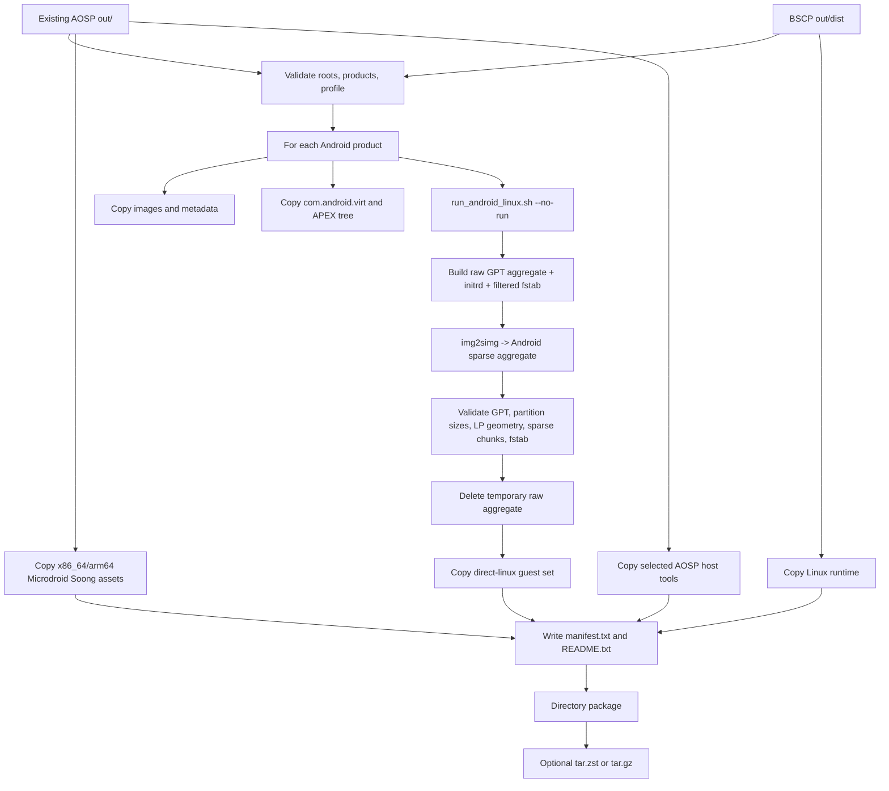

# AOSP 产物打包流程

简体中文 | [English](AOSP_ARTIFACT_PACKAGING.md)

本文说明如何使用 [package_aosp_vm_artifacts.sh](../scripts/package_aosp_vm_artifacts.sh) 将已经
构建完成的 AOSP 产品、Microdroid Guest 资源和 BSCP Linux Host runtime 整理为一个可传输、
可验证的目录包。本文以当前脚本行为为准，并区分“复制成功”“结构校验通过”和“可以发布”三种
不同状态。

> 打包脚本不会执行 `repo sync`、AOSP clean 或完整 AOSP build。它只消费现有输出，并为完整
> Android 重新生成 direct-boot 聚合磁盘。AOSP 构建的来源、配置和可复现性必须在打包之前
> 单独保证。

## 1. 打包目标与边界

打包流程同时收集三类内容：

1. **完整 Android/Cuttlefish Guest**：产品镜像、产品元数据、direct-linux kernel/initrd、
   过滤后的 fstab 和 Android sparse GPT 聚合磁盘。
2. **Microdroid Guest**：产品中的 `com.android.virt` APEX 内容、APEX runtime tree，以及
   x86_64/arm64 Soong 中间产物。
3. **Host 运行环境**：当前 BSCP Linux x86_64 runtime 和工作区中存在的少量 AOSP Host 工具。

当前包不是四平台完整安装包。`host/linux-x86_64` 只复制 Linux Host runtime；macOS 与
Windows 的 Host 二进制需要在对应平台构建和交付。Guest 资源在 CPU 架构和 Guest ABI 匹配时
可被不同 Host 消费。

## 2. 流程总览



## 3. 输入目录

默认目录由根仓库位置派生：

| 参数/环境变量 | 默认值 | 用途 |
| --- | --- | --- |
| `--aosp-root` / `AOSP_ROOT` | `../aosp` | 已经构建的 AOSP 工作区 |
| `--dist-root` | `out/dist` | 已经构建的 BSCP Host runtime |
| `--output-root` / `OUTPUT_ROOT` | `out/packages` | 目录包和压缩包输出根目录 |
| `--package-name` | 时间戳名称 | 输出目录名 |
| `--products` | `vsoc_x86_64,vsoc_arm64_only` | 要收集的 Android 产品 |

每个产品必须存在于：

```text
<aosp-root>/out/target/product/<product>/
```

脚本还使用以下 AOSP 输出：

- `out/host/linux-x86/bin/`：`img2simg`、`simg2img`、`adb`、`avbtool`、`lpmake` 等；
- `out/host/linux_musl-arm64/bin/adb`：存在时收集 arm64 Linux ADB；
- `out/soong/.intermediates/packages/modules/Virtualization/build/microdroid/`：两种架构的
  Microdroid kernel、initrd、super、vbmeta、JSON 和 fstab；
- 产品的 `apex/`、`system/apex/`、`system_ext/apex/` 与 `vendor/apex/`：Microdroid Host
  APEX runtime tree。

## 4. AOSP 构建前提

AOSP 构建不属于本脚本。应使用项目固定的 manifest、分支、产品配置和 toolchain 完成构建，
并在打包前确认目标产品目录不是不同基线或不同 lunch 配置的混合输出。下面仅表达流程，不是
对任意 AOSP 分支通用的 lunch 名称承诺：

```bash
cd /absolute/path/to/aosp
source build/envsetup.sh
lunch <project-selected-product>-userdebug
m -j"$(nproc)" droid dist
```

默认 ARM 产品选择 `vsoc_arm64_only`，因为 Apple Silicon/HVF 不能直接执行 mixed-ABI
`vsoc_arm64` 中的 AArch32 userspace。需要确保至少存在：

- `kernel`、`ramdisk.img`、`vendor_ramdisk.img`、`vendor-bootconfig.img`；
- `boot.img`、`vendor_boot.img`、`vbmeta.img`、`vbmeta_system.img`；
- `super.img`、`userdata.img`、`misc_info.txt`；
- `vendor/etc/fstab.cf.f2fs.hctr2`；
- AOSP Host `lz4`、`img2simg` 和 `simg2img`。

Microdroid 内容还要求构建对应的 `com.android.virt` APEX 与 Soong Microdroid targets。当前
复制函数会跳过某些不存在的可选文件，因此“脚本结束”本身不能证明 Microdroid 集合完整。

## 5. Host 工具前提

打包流程面向 Linux shell 环境，依赖：

- Bash、GNU `cp`（使用 `-L --sparse=always`）、`rsync`、`sed`、`awk`、`find`、`file`、
  `tar`、`du` 与 coreutils；
- Python 3、`cpio`、`mkfs.ext4`；
- AOSP Host `lz4`、`img2simg`、`simg2img`；
- 可选 `zstd`，不存在时归档自动退回 gzip；
- `out/dist/linux/bin/crosvm`，且其构建包含 direct Android 所需 feature。

虽然内部调用 `run_android_linux.sh --no-run` 不启动 Guest，但当前 runner 仍会探测网络 feature，
并在未显式关闭网络时准备 Cuttlefish TAP。打包脚本当前没有传入 `--no-network`，因此执行环境
可能需要 `sudo`/网络设备权限，并可能留下可复用 TAP。这是现有实现行为，不应把它描述成纯粹
的无权限文件复制步骤。

## 6. 推荐命令

先构建 BSCP Linux runtime，再使用显式绝对目录和唯一包名：

```bash
./build_all.sh

./scripts/package_aosp_vm_artifacts.sh \
  --aosp-root /absolute/path/to/aosp \
  --dist-root /absolute/path/to/bscp/out/dist \
  --output-root /absolute/path/to/release-staging \
  --package-name bscp-vm-artifacts-release-candidate \
  --products vsoc_x86_64,vsoc_arm64_only \
  --data-encryption metadata \
  --archive
```

只打包一个产品：

```bash
./scripts/package_aosp_vm_artifacts.sh \
  --aosp-root /absolute/path/to/aosp \
  --package-name bscp-vm-artifacts-x86_64 \
  --products vsoc_x86_64 \
  --data-encryption metadata
```

`PACKAGE_DIR=<output-root>/<package-name>` 在开始时会被递归删除后重建。不要让
`--package-name` 指向现有发布目录，也不要使用未经检查的变量或宽泛路径。

## 7. 数据加密 profile

| 参数 | 默认 fstab suffix | 语义 | 发布要求 |
| --- | --- | --- | --- |
| `--data-encryption metadata` | `cf.f2fs.hctr2` | 要求 `/data` 保留 metadata encryption flags | 默认发布候选配置 |
| `--data-encryption none` | `dev.direct` | 移除加密 flags，并让 `/data` 在 first stage 挂载 | 仅兼容性开发，不能表示静态数据受保护 |

可以用 `--fstab-suffix` 覆盖 suffix，但只允许字母、数字、点、下划线和连字符。自定义 suffix
必须与 bootconfig 和 Guest fstab 选择一致。`none` profile 不是 metadata encryption 的降级
替代品，也不能依靠 nonsecure KeyMint 宣称生产级密钥保护。

## 8. 每个 Android 产品的处理

### 8.1 收集原始产品文件

脚本把产品顶层的 `*.img`、kernel 变体和 bootloader 复制到 `images/`，把
`android-info.txt`、`misc_info.txt`、build fingerprint、required images、installed-files
清单和 `module-info.json` 等复制到 `meta/`。复制会跟随符号链接并尽量保留稀疏文件布局。

### 8.2 生成 direct-boot 输入

脚本调用 `run_android_linux.sh --no-run`，由 runner：

1. 选择唯一的动态分区文件系统类型；
2. 根据 encryption profile 过滤并验证 Android fstab；
3. 在文件不存在时创建 64 MiB `misc`、64 MiB ext4 `metadata` 和 1 MiB FRP 辅助镜像；
4. 合并 ramdisk、vendor ramdisk、附加 fstab cpio 和 bootconfig，生成 `initrd_android.img`；
5. 调用 `create_cf_android_disk.py` 生成 protective MBR + primary/backup GPT 原始聚合盘；
6. 生成 HVC 输入目录，但因为 `--no-run` 不启动 crosvm 或设备 daemon。

runner 会复用已存在的 misc、metadata 和 FRP 文件。打包前必须确认根仓库的
`out/android-linux` 与 `out/android-linux-<product>` 是专用且干净的 staging 状态；否则旧
实例的 boot、加密或 FRP 状态可能进入聚合盘和发布包。

GPT 按 1 MiB 对齐，包含源文件存在时的 misc、A/B boot、init_boot、vendor_boot、vbmeta、
vbmeta_system、可选 DLKM vbmeta、super、userdata、FRP 和 metadata 分区。详细分区语义参见
[完整 Android 实现详解](ANDROID.zh-CN.md)。

### 8.3 转换与校验

原始 `aggregate_android.img` 使用 AOSP `img2simg` 转换为
`aggregate_android.sparse.img`。内置 Python 校验器随后检查：

- 原始盘的 `EFI PART` GPT header、分区 extent 和 `super`/`userdata` 存在性；
- `super`/`userdata` 分区大小与 `misc_info.txt` 完全一致；
- `super` 内不是未展开的 Android sparse image，并存在有效 LP metadata geometry；
- sparse header、chunk 类型/大小、逻辑 block 数和文件结束位置一致；
- sparse 展开后大小与原始聚合盘完全一致；
- 过滤后的 fstab 每行恰有五列，同一 mount point 没有冲突文件系统，并包含
  `/system`、`/data`、`/metadata`。

只有这些检查全部通过，临时 raw aggregate 才会被删除，并把 compact sparse aggregate、
initrd、fstab DT、DTB、辅助分区、HVC 目录和 kernel 复制进包。Android sparse backend 是
只读消费路径；运行前必须用 `simg2img` 展开为每实例私有的可写 raw sparse 文件。

## 9. Microdroid 与 Host 内容

每个产品会尝试收集：

- `apex/com.android.virt` 及可选 symbols app；
- `system/apex`、`system_ext/apex`、`vendor/apex` 和产品 `apex` 目录；
- 产品相关 Microdroid APEX runtime tree。

脚本还固定尝试复制两个 Soong 架构：

| 包内标签 | Soong variant | 主要文件 |
| --- | --- | --- |
| `x86_64` | `android_x86_64_silvermont` | kernel/signed kernel、normal/debuggable initrd、super、vbmeta、JSON、fstab |
| `arm64` | `android_arm64_armv8-a_cortex-a53` | 同上 |

Host 部分复制 `out/dist/linux` 到 `host/linux-x86_64/dist`。AOSP Host tools 只选择实际存在的
ADB、AVB、LP 和 sparse-image 工具，不是完整的 `out/host` 副本。

## 10. 输出目录结构

```text
<package-name>/
├── README.txt
├── manifest.txt
├── archive.path                 # 仅目录包中记录；归档完成后生成
├── products/
│   ├── android/<product>/
│   │   ├── images/
│   │   ├── meta/
│   │   ├── vendor/etc/
│   │   └── direct-linux/
│   │       ├── aggregate_android.sparse.img
│   │       ├── initrd_android.img
│   │       ├── android_fstab.dt
│   │       ├── android_fstab_extra.cpio.lz4
│   │       ├── android.dtb              # 仅源工作目录已存在时复制
│   │       ├── misc.img
│   │       ├── metadata.img
│   │       ├── factory_reset_protected.img
│   │       ├── kernel
│   │       ├── hvc/
│   │       └── README.txt
│   └── microdroid/
│       ├── <product>/com.android.virt/
│       ├── <product>/apex_dir/
│       └── soong/{x86_64,arm64}/
├── host/linux-x86_64/dist/
├── host-tools/{linux-x86_64,linux-arm64}/bin/
└── licenses/                    # BSCP 条款及选定的顶层第三方声明
```

`manifest.txt` 是源路径到包内路径的复制日志，不是加密哈希 manifest。`README.txt` 记录生成
时间、BSCP commit、数据 profile 和输入根目录。复制的 `licenses/` 是基础声明集合，不能替代
自动生成的 SBOM 和完整文件级许可证清单。

## 11. 可选归档

`--archive` 保留目录包，并额外生成：

- 有 `zstd`：`<package-name>.tar.zst`，压缩级别由 `ZSTD_LEVEL` 控制，默认 3；
- 无 `zstd`：`<package-name>.tar.gz`。

压缩包生成后，路径写入目录包中的 `archive.path`。当前脚本不生成 archive SHA-256、不签名、
不生成 SBOM，也不汇总许可证。对外发布必须追加这些步骤。

## 12. 发布前验证

建议在隔离 staging 目录中执行：

```bash
PACKAGE=/absolute/path/to/release-staging/bscp-vm-artifacts-release-candidate

test -s "$PACKAGE/README.txt"
test -s "$PACKAGE/manifest.txt"
test -s "$PACKAGE/products/android/vsoc_x86_64/direct-linux/aggregate_android.sparse.img"

(
  cd "$PACKAGE"
  find . -type f ! -name SHA256SUMS -print0 | sort -z | xargs -0 sha256sum > SHA256SUMS
  sha256sum --check SHA256SUMS
)
```

还应完成：

- 将 sparse aggregate 展开到临时可写盘，并运行对应平台的 Android boot/marker 回归；
- 使用打包后的 APEX tree 和 Soong 资源运行 Microdroid 回归；
- 检查 ELF/PE/Mach-O 架构与产品标签一致；
- 保存 manifest revisions、AOSP build fingerprint、toolchain 版本和构建日志；
- 生成第三方许可证、SBOM、签名和可验证发布 provenance；
- 解包最终 archive 后重新执行哈希和目录完整性检查。

## 13. 敏感信息与发布卫生

当前生成的 `manifest.txt` 包含源文件绝对路径，顶层 `README.txt` 也记录 `Repo` 与
`AOSP root`。这些路径可能泄漏用户名、磁盘布局、内部项目名或构建基础设施信息。外发前必须
生成经过审查的相对路径 manifest，或在保留审计映射的内部包与去标识化外部包之间做明确分层。

同时检查并移除：

- 签名私钥、凭据、SSH 配置、环境 dump 和 shell history；
- `.repo/`、`.git/`、`out` 日志、Guest userdata 和真实实例状态；
- 被 runner 复用的 misc、metadata、FRP 或其他历史可写镜像；
- 调试证书、debuggable initrd、ADB key 和未经批准的 symbols；
- 开发 profile、绝对路径、主机名、用户名、IP、内部 URL 和时间记录。

不要直接修改已经归档的包；应从受审输入重新打包，再生成哈希和签名。

## 14. 当前实现限制与故障定位

### 14.1 `require_file: command not found`

当前版本的 `package_aosp_vm_artifacts.sh` 在 direct-boot 阶段调用 `require_file`，但没有在本
脚本中定义或引入该函数。因此当前代码会在 `run_android_linux.sh --no-run` 返回后中止。
这是发布阻断问题，不能通过删除检查语句或手工跳过 `validate_direct_android_images` 来规避；
修复后应重新执行完整打包和校验。

### 14.2 包完整性不是强制门禁

部分 `copy_file`/`copy_dir` 对不存在的可选内容静默跳过。当前没有统一 schema 检查来确保
两个架构的 Microdroid 资源、Host runtime 和全部选定工具齐全。发布系统应维护按 profile 的
必需文件清单并在归档前强制校验。脚本还把 `out/dist/linux` 固定写入
`host/linux-x86_64`，但没有验证其中二进制的实际架构；在 arm64 Linux Host 上生成包时尤其
需要阻止错误标签。

### 14.3 工作目录可能复用历史状态

`run_android_linux.sh` 只在 misc、metadata 和 FRP 辅助镜像不存在时创建它们；打包入口不会
清理 `out/android-linux` 或 `out/android-linux-<product>`。此外，`android.dtb` 不是当前 runner
生成物，但如果工作目录中已经存在，复制函数仍会把它带入包。发布前必须使用受控的干净
staging 状态，并按必需清单拒绝来源不明或本轮未生成的文件。

### 14.4 不是可复现构建证明

包名、README 和 manifest 包含当前时间和绝对路径，GPT GUID 也随机生成；输入来自现有 AOSP
`out/`，而不是由脚本执行 clean build。因此两个内容等价的构建也不会天然产生逐字节相同的包。
需要可复现交付时，应固定时间源、GUID、文件顺序、权限、owner、archive metadata 和工具版本。

### 14.5 常见失败

| 错误 | 检查方向 |
| --- | --- |
| 缺少 product | `--aosp-root`、产品名和 `out/target/product/<product>` |
| 缺少 crosvm | 先运行 `build_all.sh`，检查 `--dist-root` |
| 缺少 `img2simg`/`lz4` | 构建 AOSP Host tools，检查 `out/host/linux-x86/bin` |
| 无法选择动态 FS | 检查 `misc_info.txt` 的 `system_fs_type` 和产品 fstab |
| metadata encryption 检查失败 | `/data` fstab flags 与 `--data-encryption` 不一致 |
| TAP/权限失败 | 当前 runner 的网络准备行为；检查 sudo/设备权限和残留 TAP |
| GPT/LP 检查失败 | 检查 super 是否展开、分区尺寸和混合/陈旧 AOSP 输出 |
| sparse chunk 检查失败 | 重新生成原始聚合盘，确认 `img2simg` 版本和磁盘完整性 |

## 15. 相关文档与代码

- 完整 Android：[ANDROID.zh-CN.md](ANDROID.zh-CN.md)
- Microdroid：[MICRODROID.zh-CN.md](MICRODROID.zh-CN.md)
- 部署：[DEPLOYMENT.zh-CN.md](DEPLOYMENT.zh-CN.md)
- 安全：[SECURITY.zh-CN.md](SECURITY.zh-CN.md)
- 打包入口：[package_aosp_vm_artifacts.sh](../scripts/package_aosp_vm_artifacts.sh)
- Android runner：[run_android_linux.sh](../scripts/run_android_linux.sh)
- GPT 生成器：[create_cf_android_disk.py](../scripts/create_cf_android_disk.py)
