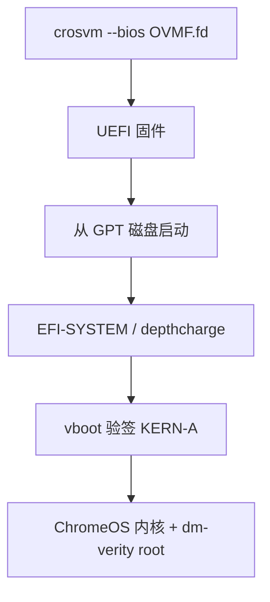

# ChromiumOS 固件启动（优先方案）

**优先方案**：OVMF（UEFI）+ 磁盘，让 **depthcharge → vboot → dm-verity** 走完整 ChromeOS 启动链，不直接加载 bzImage。

## 一键启动

### 经 virtmgr（推荐，与 Microdroid 同路径）

```powershell
.\scripts\run_chromeos_firmware.ps1
```

等价于：

```powershell
.\scripts\vm_windows.ps1 -Command run -Config scripts\chromiumos_windows_firmware.json -Console ttyS0
```

配置：`scripts\chromiumos_windows_firmware.json`（仅 `bootloader` + `disks`，**无 kernel / params**）。

### 直接 crosvm（调试）

```powershell
.\scripts\run_chromeos_firmware.ps1 -Direct
# 或
.\scripts\run_crosvm_chromeos_firmware.ps1 -Firmware ovmf -TimeoutSecs 120
```

## 固件二进制（现成，无需 WSL）

| 文件 | 路径 |
|------|------|
| OVMF 合并镜像 | `out/dist/firmware/OVMF.fd` |
| OVMF CODE / VARS | `OVMF_CODE.fd` / `OVMF_VARS.fd` |
| SeaBIOS（对照） | `bios.bin` |

从 Debian 包解压步骤见下文「下载固件」。

Guest 磁盘：`out/dist/img/amd64-generic_test_image.bin`（R150 amd64-generic-public）。

## 架构说明



与 **直接内核启动**（`chromiumos_windows_raw.json`）对比：

| 项目 | 固件路径（优先） | 直接内核（已证实失败） |
|------|------------------|------------------------|
| kernel 字段 | 无 | 有（从 KERN-A 提取的 bzImage） |
| bootloader | `OVMF.fd` | 无 |
| 启动链 | depthcharge / vboot | 跳过固件 |
| Windows 状态 | WHPX IO 仿真问题（见下） | mmio@0 死循环 |

## Windows crosvm 注意点

1. **`run` 必须带 `--bios` 或内核**；不能单独 `--pflash`。virtmgr 的 `bootloader` 字段会映射为 `--bios`。
2. **OVMF.fd 作为 `--bios`**：crosvm 将其映射到 4G 以下 ROM 区（与 Linux 上双 pflash 等效简化用法）。
3. **控制台**：固件阶段用 **ttyS0**（`console_input_device: ttyS0`），不是 hvc0。
4. **磁盘**：`writable: true`，block 带 `bootindex=1`（直接 crosvm 脚本已设置）。
5. **ANGLE**：`PATH` 需含 `C:\workspace\bscp\angle\out\Release-GfxAngle-Clang`（gfxstream 时）。

## 固件可见性 / 调试

发布版 Debian OVMF 通常**无**串口或 debugcon 日志（RELEASE 构建）。direct crosvm 脚本默认捕获 **debugcon 0x402** 与 **ttyS0**。

详见：**[CHROMIUMOS_FIRMWARE_VISIBILITY.md](CHROMIUMOS_FIRMWARE_VISIBILITY.md)**（GPT 检查、`bootindex`、depthcharge 控制台、gfxstream 下一步）。

```powershell
.\scripts\inspect_chromeos_gpt.ps1
.\scripts\run_crosvm_chromeos_firmware.ps1 -Firmware ovmf -TimeoutSecs 180
.\scripts\run_chromeos_firmware_gfx.ps1   # 需 gfxstream 版 crosvm
```

## 下载固件

```powershell
$fw = "out/dist/firmware"
New-Item -ItemType Directory -Force -Path $fw | Out-Null
Invoke-WebRequest -Uri "http://ftp.debian.org/debian/pool/main/o/ovmf/ovmf_2025.02-9_all.deb" -OutFile "$fw/ovmf.deb"
Invoke-WebRequest -Uri "http://ftp.debian.org/debian/pool/main/s/seabios/seabios_1.16.3-2_all.deb" -OutFile "$fw/seabios.deb"
tar -xf "$fw/ovmf.deb" -C $fw
tar -xf "$fw/seabios.deb" -C $fw
Copy-Item "$fw/usr/share/OVMF/OVMF.fd" "$fw/OVMF.fd"
Copy-Item "$fw/usr/share/OVMF/OVMF_CODE.fd" "$fw/OVMF_CODE.fd"
Copy-Item "$fw/usr/share/OVMF/OVMF_VARS.fd" "$fw/OVMF_VARS.fd"
Copy-Item "$fw/usr/share/seabios/bios.bin" "$fw/bios.bin"
```

## WHPX 固件 IO（已修复，2026-05-29）

此前 OVMF 启动会刷 `failed to handle io (os error 8)`（见下方“修复前”）。**根因与补丁**见 [`doc/CHROMIUMOS_WHPX_IO_FIX.md`](CHROMIUMOS_WHPX_IO_FIX.md)：

- **根因**：PIO 指令仿真时 WHPX 调用 `memory_cb`，但 crosvm 未传入 MMIO 回调 → `MemoryCallbackFailed`。
- **修复**：`WhpxVcpu::handle_io_with_mmio` + Windows `vcpu_loop` 在 `VcpuExit::Io` 时同时处理 PIO/MMIO。
- **验证**：`scripts/run_crosvm_ovmf_min_repro.ps1` 修复后 stderr **113 字节、0 条 IO 错误**（修复前 20s 内 20MB+）。

**当前阻塞（修复后）**：固件链不再 IO 风暴，但 **`guest-serial-num1.txt` 仍为 0 字节**（180s OVMF+磁盘测试）。可能需 OVMF 串口调试构建、启动顺序或显示设备；与 IO 仿真为不同问题。

修复前参考：[crosvm-dev UEFI on Windows](https://groups.google.com/a/chromium.org/g/crosvm-dev/c/Z5ad5lYLnss)。直接 bzImage 仍会 mmio@0（`doc/CHROMIUMOS_WINDOWS_MMIO_DEBUG.md`）。

## 日志位置

| 方式 | 目录 |
|------|------|
| `-Direct` | `out/dist/logs/cros-fw-ovmf/` |
| virtmgr | `out/dist/logs/chromeos-firmware-guest.log`、virtmgr 临时目录下 `crosvm-stderr.txt` |

环境变量：`VIRTMGR_CAPTURE_GUEST_CONSOLE=1`、`VIRTMGR_CAPTURE_CROSVM_STDIO=1`。

## 调试命令

```powershell
# 最小复现（OVMF only）
$env:CROSWVM_WHPX_IO_DEBUG = "1"
.\scripts\run_crosvm_ovmf_min_repro.ps1 -TimeoutSecs 30

# 分析 WHPX 诊断行
.\scripts\analyze_whpx_io_log.ps1 -StderrLog out\dist\logs\whpx-ovmf-min-repro\crosvm-stderr.txt
```

## 后续

1. ~~WHPX PIO+MMIO 仿真~~（已完成，见 `CHROMIUMOS_WHPX_IO_FIX.md`）。
2. 获取 OVMF/depthcharge 串口输出（调试固件或确认 COM 端口）。
3. 有串口日志后挂 gfxstream + ANGLE。
4. 可选：virtmgr `pflash`（`OVMF_CODE` + 可写 `OVMF_VARS`）。
