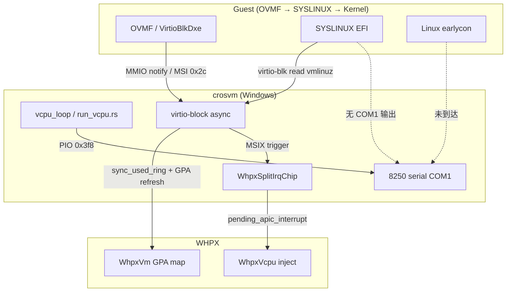

# ChromeOS WHPX 启动：代码变更审查与实现文档

**目标**：在 Windows/WHPX 上通过 `crosvm + OVMF_DEBUG + SYSLINUX` 启动 ChromeOS 测试镜像（`amd64-generic_test_image_boot.bin`），直至内核 serial 出现 dmesg。

**变更范围**：`external/crosvm/` 子模块（约 28 文件，+1637 / −91 行），及仓库根目录 boot/诊断脚本。

**当前状态（2026-05-31）**：

| 阶段 | 状态 |
|------|------|
| OVMF → BOOTX64.EFI → ExitBootServices | ✅ 完成 |
| Virtio-blk OVMF 阶段 GPT/分区读取 | ✅ 完成（used-ring 一致性 + 中断修复） |
| SYSLINUX 加载 vmlinuz（virtio-blk 500+ completions） | ⚠️ 部分（有磁盘 I/O，无 COM1 输出） |
| Linux kernel earlycon / dmesg | ❌ 未达成 |
| RO 模式结束方式 | Guest `0xcf9=0x06` hard reset，~28s |
| RW 模式 | Double-boot（2× SecCoreStartup），120s 超时 |

---

## 1. 架构概览



---

## 2. 问题分层与修复映射

| # | 症状 | 根因 | 修复位置 | 状态 |
|---|------|------|----------|------|
| 1 | `MemoryCallbackFailed` IO 风暴，serial 0 字节 | WHPX `ins` 类指令需 MMIO callback，`handle_io` 未提供 | `hypervisor/src/whpx/vcpu.rs`, `run_vcpu.rs` | ✅ |
| 2 | OVMF virtio-blk 轮询 used ring 无进展 | WHPX host 写 guest RAM 后 vCPU TLB/GPA 不可见 | `split_queue.rs`, `whpx_ovmf.rs`, `vm.rs`, `guest_memory.rs` | ✅ |
| 3 | `failed to inject interrupts` 216+ | 同轮 APIC+PIC 双注入；MSI 后多余 `vcpu.interrupt` | `whpx.rs`, `vcpu.rs` | ✅ |
| 4 | MSI 0x2c `WHvRequestInterrupt` 成功但未送达 | WHPX MSI 不可靠；需 `PendingInterruption` 直注 | `whpx.rs` `send_msi` + `inject_interrupts` | ✅ |
| 5 | ExitBootServices 后 virtio-blk 无完成中断 | MSIX entry 被 mask；IOAPIC pin12/0 被 mask | `msix.rs`, `whpx.rs` IOAPIC fallback | ✅ |
| 6 | MMIO notify 走 fallback 路径 | WHPX ioevent 未拦截 notify 写 | `virtio_pci_device.rs` + sync batch | ✅ 可工作 |
| 7 | SYSLINUX 无 serial；RO 后 `0xcf9` reset | Bootloader/内核引导失败（非 WHPX 挂死） | — | ❌ 待查 |

---

## 3. 按层次详解

### 3.1 Hypervisor — `hypervisor/src/whpx/`

#### `vcpu.rs`（+380 行量级）

**A. IO/MMIO 仿真修复**

- 新增 `handle_io_with_mmio`：`InstructionEmulatorContext` 同时提供 PIO 与 MMIO handler，修复 OVMF 对 port `0x511` 的 string I/O（`ins` 带 memory operand）导致 `MemoryCallbackFailed`。
- `handle_io` / MMIO 路径增加 `CROSWVM_WHPX_IO_DEBUG=1` 诊断（最多 128 条，含 port/RIP/status bitfield）。

**B. 中断注入可靠性**

- `ready_for_interrupt()`：改用 `interruption_pending_live()`（读 `WHvRegisterPendingInterruption`），避免 `last_exit_context` 陈旧。
- 新增 `interrupt_delivery_state()`、`log_last_exit()` 供 `run_vcpu.rs` 记录 Exception/UnrecoverableException。
- `handle_apic_init_sipi_trap()`：SMP 初始化路径补充。

**C. 禁止事项**

- **不要**在 `0xbf09fa3a/0xbf09fa3c` 做 memory poke/read 重定向 — 曾导致 guest `#UD`。

#### `vm.rs`

- `refresh_gpa_range(guest_addr, len)`：对 GPA 子范围 `Unmap` + `Map`，使 host 侧写入的 guest RAM（virtio ring/buffer）对 vCPU 可见。
- 由 `windows.rs` 注册到 `whpx_ovmf::register_gpa_refresh`。

---

### 3.2 IRQ 子系统 — `devices/src/irqchip/`

#### `whpx.rs`（核心 WHPX irqchip 修复）

**`send_msi(addr, data)`**

```text
dest_id == 0  →  pending_apic_interrupt = vector; kick vCPUs
dest_id != 0  →  WHvRequestInterrupt + kick
```

不再在 `WHvRequestInterrupt` 成功后额外 `vcpu.interrupt`（避免与 PIC 同轮双注入）。

**`inject_interrupts(vcpu)` — 顺序关键**

1. **APIC/MSI 优先**：消费 `pending_apic_interrupt`，调用 `vcpu.interrupt(vector)`。
2. **PIC 其次**：PIT/RTC 等 legacy 向量。
3. **每轮最多一次注入**（WHPX `PendingInterruption` 限制）。
4. 失败时 `set_interrupt_window_requested(true)` 延迟重试。

**IOAPIC `service_irq_event` fallback 链**

当 `ioapic.service_irq()` 返回 `injected=false`：

1. `msi_for_pin(pin)` → `send_msi`
2. `redirect_interrupt_for_pin(pin)` → direct APIC
3. **`redirect_interrupt_for_pin_unchecked(pin)`** → masked-pin APIC（pin=12 vector=0x2c，SYSLINUX 阶段）
4. **`inject_ioapic_pin_emergency(pin)`** → synthetic vector `0x20+pin`（pin=0 timer，vector=0 时）

**`pending_apic_interrupt`**

- `Arc<Mutex<Option<u8>>>`，在 `send_msi`、IOAPIC fallback、emergency 路径写入，由 boot vCPU 在 `inject_interrupts` 消费。

#### `ioapic.rs`

新增 API（供 WHPX fallback 使用）：

| 函数 | 用途 |
|------|------|
| `msi_for_pin` | 从 redirect table 构造 MSI addr/data |
| `redirect_interrupt_for_pin` | 尊重 mask 的 APIC 参数 |
| `redirect_interrupt_for_pin_unchecked` | **忽略 mask**（ExitBootServices 后关键） |
| `preconfigure_redirect_table` / `pre_create_all_out_events` | OVMF 早期 INTx 路由 |
| `pin_delivery_state` | 诊断 masked/vector/out_event |
| guest 写 redirect table 时 `info!` 日志 | 跟踪 pin/vector/mask 变化 |

---

### 3.3 PCI MSIX — `devices/src/pci/msix.rs`

**Windows 专用：`trigger()` masked 路径**

PCI 规范要求 masked 向量只置 PBA bit，不发送 MSI。WHPX 上 ExitBootServices 后 bootloader 常 mask MSIX，导致 virtio-blk 完成无中断。

```rust
#[cfg(windows)]
if entry_masked || fn_masked {
    self.set_pba_bit(vector, true);
    if let Some(irq) = ... {
        let _ = irq.irqfd.signal();  // 仍触发 WHPX irq 路径
    }
}
```

**效果**：post-ExitBootServices 恢复 MSI 0x2c 投递（RO 模式 verified：0 → 385+ 次 direct APIC 0x2c）。

---

### 3.4 Virtio 块设备 — `devices/src/virtio/`

#### `block/asynchronous.rs`（WHPX 专用路径）

| 机制 | 说明 |
|------|------|
| `sync_guest_writes()` | 请求完成后 flush 数据/status 到 guest RAM |
| 同步 `process_one_chain` | Windows 上不用 background task batch，**逐请求完成再返回 guest** |
| `force_used_interrupt()` | EVENT_IDX 抑制中断时仍 signal used queue |
| `batch_done` Event | MMIO notify fallback 同步等待队列 drain |
| `whpx_reset_queue_batch` / `whpx_wait_queue_batch` | `virtio_pci_device` fallback 路径调用 |
| `completion #N` 日志 | 前 5 次 + 每 500 次 info 级别采样 |

#### `queue/split_queue.rs`

`add_used()` 后 `sync_used_ring()`（仅 Windows）：

1. `mem.sync_guest_range(used_ring, ...)`
2. `whpx_ovmf::refresh_gpa_range`
3. `request_vcpu_tlb_flush`
4. `set_used_idx_gpa(used_ring + 2)`

#### `whpx_ovmf.rs`（新文件）

全局协调器：`USED_IDX_GPA`、`GPA_REFRESH` callback、`VCPU_TLB_FLUSH_REQUESTED`。
由 `windows.rs` 注册 GPA refresh；`run_vcpu.rs` 在 vCPU run 前 `take_vcpu_tlb_flush_request()` 触发 CR3 reload。

#### `virtio_pci_device.rs`

MMIO notification 写到达 `write_bar` 时（ioevent 未拦截）：

```text
whpx_reset_queue_batch → signal queue_evt → whpx_wait_queue_batch
```

#### `descriptor_utils.rs` / `guest_memory.rs`

- `Writer::sync_guest_writes()` → `regions.sync_consumed`
- `GuestMemory::sync_guest_range()` — WHPX 内存同步原语

---

### 3.5 Windows vCPU 循环 — `src/sys/windows/run_vcpu.rs`

**诊断环境变量**

| 变量 | 作用 |
|------|------|
| `CROSWVM_PIO_TRACE=1` | PIO 访问 trace；`0x3f8`/`0xcf9`/`0x402` 等始终记录（超 512 条上限） |
| `CROSWVM_WHPX_IO_DEBUG=1` | WHPX IO/MMIO 仿真失败详情 |

**PIO trace 增强**

- `0x3f8`（COM1）、`0xcf9`（reset）写入时记录 `data=0xNN` 字节。
- 实测：`0xcf9 data=0x06` = Hard Reset + Full Reset（RO 模式 SYSLINUX 失败后 guest 主动复位）。

**Virtio 轮询日志**

- `log_virtio_poll_read()`：OVMF 轮询 `0xbf09fa3a/bf09fa3c` 及 used ring GPA 范围（采样）。

**异常处理**

- `UnrecoverableException`、`Exception`、`UnsupportedFeature` → 调用 `WhpxVcpu::log_last_exit()`。

**WHPX IO 路径**

- `VcpuExit::Io` 使用 `handle_io_with_mmio`，PIO 与 MMIO 共用 bus handler。

---

### 3.6 主机集成 — `src/sys/windows.rs`

- 启动 WHPX split irqchip 后调用 `ioapic.pre_create_all_out_events()`。
- 注册 `whpx_ovmf::register_gpa_refresh` → `WhpxVm::refresh_gpa_range`。
- vCPU 线程 CR3/TLB flush 钩子（配合 `take_vcpu_tlb_flush_request`）。

---

## 4. 启动脚本与镜像

### `scripts/run_crosvm_chromeos_firmware.ps1`

| 参数 | 默认 | 说明 |
|------|------|------|
| `-Firmware ovmf-debug` | — | 使用 `OVMF_DEBUG.fd`（**必须 DEBUG 版**，release OVMF 在 port 0x511 挂死） |
| `-BlockReadOnly` | off | `ro=true` 避免 SYSLINUX 写盘触发 reset loop |
| `-GpuBackend 2d` | none | Framebuffer 可看 SYSLINUX 错误（COM1 无输出时） |
| `-LogDir` | auto | serial / stderr / summary |
| `-TimeoutSecs` | 120 | |

**Serial 配置**

- COM1 → `guest-serial-num1.txt`（`earlycon=true`）
- debugcon port 0x402 → `guest-debugcon.txt`
- virtio-console → `guest-virtio-console1.txt`

### SYSLINUX 镜像补丁

- 脚本：`scripts/fix_chromeos_syslinux_wsl.sh`（WSL mount EFI 分区 offset `228589568`）
- 已验证镜像内容：`DEFAULT chromeos-usb.A`，`usb.A.cfg` 含 `cros_efi` + `console=ttyS0` + `earlycon=uart8250,io,0x3f8`

---

## 5. 构建与部署

```powershell
cd external\crosvm
$env:CARGO_TARGET_DIR = "c:\workspace\bscp\bscp\out\target"
rustup run stable cargo build --release -p crosvm `
  --target x86_64-pc-windows-gnu `
  --features "whpx,composite-disk,android-sparse,gpu"

Copy-Item ..\..\out\target\x86_64-pc-windows-gnu\release\crosvm.exe `
  ..\..\out\dist\windows\bin\crosvm.exe -Force
```

**推荐测试（RO）**

```powershell
$env:CROSWVM_PIO_TRACE = "1"
.\scripts\run_crosvm_chromeos_firmware.ps1 `
  -Firmware ovmf-debug -TimeoutSecs 120 `
  -LogDir out\dist\logs\cros-fw-test `
  -Image out\dist\img\amd64-generic_test_image_boot.bin `
  -MemMiB 4096 -BlockReadOnly -GpuBackend 2d
```

---

## 6. 验证结果摘要

### 6.1 中断修复前后

| 指标 | 修复前 | 修复后 |
|------|--------|--------|
| `failed to inject interrupts` | 216+ | **0** |
| post-ExitBootServices MSI 0x2c | 0 | **385+**（MSIX fix） |
| IOAPIC pin=0 ERROR | 大量 | **0**（synthetic 0x20） |
| virtio-blk completions | 不确定 | **500+** |

### 6.2 Serial 捕获（重要结论）

**Serial 设备工作正常。** COM1 写入次数 ≈ serial 文件字节数（~110k）。ExitBootServices 后无新 serial 是因为 **guest 未写 COM1**，不是 crosvm 丢失数据。

最后 COM1 输出为 OVMF：

```text
SetUefiImageMemoryAttributes - ... (0x0000000000000008)
```

### 6.3 RO vs RW

| 模式 | serial | 行为 |
|------|--------|------|
| RO (`-BlockReadOnly`) | 110,718 B | ~28s，`0xcf9=0x06` 单次 hard reset，exit=0 |
| RW | 143,966 B | 120s 超时，**2× SecCoreStartup** double-boot，无 SYSLINUX 文本 |

**建议**：WHPX 调试继续用 **RO 模式**。

### 6.4 日志目录参考

| 目录 | 用途 |
|------|------|
| `out/dist/logs/cros-fw-ro-cf9/` | RO + cf9 数据字节 |
| `out/dist/logs/cros-fw-ro-timer/` | RO + timer emergency |
| `out/dist/logs/cros-fw-rw/` | RW double-boot |

---

## 7. 代码审查意见

### 7.1 应保留的变更（不可回退）

1. **`inject_interrupts` APIC-before-PIC 单注入** — 消除 WHPX 双注入错误。
2. **`send_msi` → `pending_apic_interrupt`** — virtio-blk MSI 可靠送达。
3. **`sync_used_ring` + GPA refresh** — OVMF virtio-blk 读盘根因修复。
4. **`msix.rs` Windows masked trigger** — ExitBootServices 后中断恢复。
5. **`handle_io_with_mmio`** — OVMF 基础 IO 仿真。

### 7.2 平台隔离良好

- 几乎所有 virtio/irq 修复使用 `#[cfg(windows)]`，Linux/KVM 路径保持原有 async batch 行为。
- `whpx_ovmf.rs` 仅在 Windows WHPX 构建中使用。

### 7.3 待改进（非阻塞）

| 项 | 说明 |
|----|------|
| PIO trace 日志量 | `CROSWVM_PIO_TRACE=1` 可产生 ~19MB stderr；生产应默认关闭 |
| `completion #N` info 日志 | 验证完成后可降为 debug |
| `inject_ioapic_pin_emergency` synthetic 0x20 | 在 guest 清空 pin0 vector 时可能过度注入；目前无害 |
| MMIO notify ioevent | 根本修复 WHPX ioevent 注册可减少 fallback 同步开销 |
| GPA refresh 粒度 | 每次 `add_used` 全 ring remap + CR3 flush，性能可优化 |

### 7.4 风险点

- **MSIX masked 仍 signal irqfd** 违反 PCI 严格语义，但为 WHPX boot 所必需；若 guest 依赖 PBA-only 行为可能需再加条件。
- **RW 模式 double-boot** 可能损坏 EFI 分区缓存；测试 SYSLINUX 错误优先用 GPU 2d 而非 RW。

---

## 8. 当前阻塞与后续方向

**阻塞**：SYSLINUX 阶段完成大量 virtio-blk 读盘后 **~3.5s 静默**，然后 **RO：`0xcf9` hard reset**；无 COM1/SYSLINUX/内核输出。

**可能原因**（按优先级）：

1. SYSLINUX **Boot error** 仅显示在 framebuffer（需 GPU 2d 目测或截图）。
2. `vmlinuz.A` 加载/校验失败（ChromeOS `cros_efi` 路径 WHPX 兼容）。
3. 内核 jump 后 earlycon 初始化前 crash。
4. RW 写盘触发固件状态损坏（已用 RO 规避）。

**建议下一步**：

1. GPU 2d 窗口截图 / 增加 framebuffer 转储。
2. 统计 virtio-blk 总读取字节 vs `vmlinuz.A` 文件大小。
3. 延长 RO timeout，确认 reset 前是否有遗漏 COM1 burst。
4. **不要**恢复 memory poke `0xbf09fa3a/bf09fa3c` 或 revert MSI/irq 修复。

---

## 9. 修改文件清单

### crosvm 子模块（`external/crosvm/`）

| 文件 | 变更类型 | 摘要 |
|------|----------|------|
| `hypervisor/src/whpx/vcpu.rs` | 重大 | IO/MMIO 仿真、中断 live 状态、诊断 |
| `hypervisor/src/whpx/vm.rs` | 中等 | `refresh_gpa_range` |
| `devices/src/irqchip/whpx.rs` | 重大 | MSI/IOAPIC fallback、inject 顺序 |
| `devices/src/irqchip/ioapic.rs` | 重大 | redirect/MSI API、预配置 |
| `devices/src/pci/msix.rs` | 小 | Windows masked trigger |
| `devices/src/virtio/block/asynchronous.rs` | 重大 | WHPX 同步 I/O、batch_done |
| `devices/src/virtio/queue/split_queue.rs` | 中等 | `sync_used_ring` |
| `devices/src/virtio/whpx_ovmf.rs` | **新文件** | GPA/TLB 协调 |
| `devices/src/virtio/virtio_pci_device.rs` | 小 | MMIO notify fallback + batch wait |
| `devices/src/virtio/descriptor_utils.rs` | 小 | `sync_guest_writes` |
| `devices/src/virtio/virtio_device.rs` | 小 | `whpx_*_queue_batch` trait hooks |
| `vm_memory/src/guest_memory.rs` | 小 | `sync_guest_range` |
| `src/sys/windows/run_vcpu.rs` | 重大 | PIO trace、异常、IO+MMIO |
| `src/sys/windows.rs` | 中等 | GPA refresh 注册、ioapic 预创建 |
| 其他 | 小 | `fw_cfg`, `pci_root`, `gpu/mod`, KVM/linux 兼容性等 |

### 仓库根目录

| 文件 | 摘要 |
|------|------|
| `scripts/run_crosvm_chromeos_firmware.ps1` | 主 boot 脚本（`-BlockReadOnly`, GPU） |
| `scripts/fix_chromeos_syslinux_wsl.sh` | EFI 分区 SYSLINUX 补丁 |
| `doc/CHROMIUMOS_WHPX_IO_FIX.md` | Phase 1 IO 仿真修复（早期） |
| `doc/CHROMIUMOS_FIRMWARE.md` | 固件启动总览 |
| **本文档** | 完整 WHPX boot 变更审查 |

---

## 10. 相关文档

- [CHROMIUMOS_WHPX_IO_FIX.md](CHROMIUMOS_WHPX_IO_FIX.md) — Phase 1 port 0x511 / MemoryCallbackFailed
- [CHROMIUMOS_FIRMWARE.md](CHROMIUMOS_FIRMWARE.md) — 启动链与脚本入口
- [CHROMIUMOS_FIRMWARE_VISIBILITY.md](CHROMIUMOS_FIRMWARE_VISIBILITY.md) — OVMF debugcon / GPT
- [OVMF_DEBUG_BUILD.md](OVMF_DEBUG_BUILD.md) — 构建 `OVMF_DEBUG.fd`

---

*文档版本：2026-05-31，对应当前 `external/crosvm` working tree（未提交）。*
