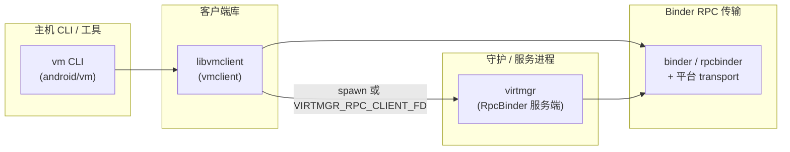

# Android Virtualization Framework：Windows / 主机移植指南（详细版）

本文档描述 **AVF 相关 Rust 主机工具链**在 **Windows（及通用 `cargo check`）**上的移植范围、架构、实现要点与运维配置。  
更细粒度的 **virtmgr** 专项说明见同目录下的子文档（见 §8）。

---

## 1. 文档范围与读者

| 内容 | 说明 |
|------|------|
| **目标读者** | 需要在 Windows 或纯主机环境编译、调试 `virtmgr`、`vm`、或依赖 **`libvmclient`** 的开发者 |
| **覆盖组件** | `libs/libvmclient`、`android/vm`、`android/virtmgr`、若干共享库桩与路径映射 |
| **不覆盖** | 完整 AOSP Soong 构建、设备端 `virtualizationservice` 二进制、Cuttlefish 真机流程（仅必要时引用） |

---

## 1.1 当前结论（按“Windows 仅纯 RPC host”定位）

- **结论**：当前移植已满足 AVF 在 Windows 主机侧的纯 RPC 开发与联调需求。
- **达标标准**：
  - `build_all.bat` 可完成 `binder-rpc -> virtmgr/vm/crosvm -> out/dist/windows` 全流程。
  - Rust `binder/rpcbinder` 能稳定链接 `binder-rpc`（关键 NDK 符号可解析）。
  - 主机侧 `virtmgr`/`vm` 的 RPC 调用链可运行。
- **边界说明**：本定位不追求 kernel binder / system server / SELinux 设备语义完全一致；Windows 下的 stub/no-op/ENOSYS 只要不影响主机 RPC 链路即为可接受。
- **建议优先级**：
  1. 固化回归（统一构建 + 最小 RPC 连通性 + 关键导出符号检查）。
  2. 对 Windows stub 做能力分级（编译桩 / 可运行桩）并持续收敛。
  3. 增强 named-pipe RPC 稳定性测试（重连、超时、并发）。

---

## 2. 主机侧架构总览

宿主机上的典型调用关系如下（与设备上通过 init/socket 连接不同）：



- **`vm`**：用户入口；通过 **`VirtualizationService::new()` + `connect()`** 拿到 **`IVirtualizationService`**。
- **`libvmclient`**：负责在需要时 **拉起 `virtmgr`**（Unix：socketpair + `command-fds`；Windows：TCP 回环 + `CreateProcessW` + CRT fd），并建立 **RpcBinder 会话**。
- **`virtmgr`**：实现 **`IVirtualizationService`**，内部再驱动 **crosvm**（Windows 上为路径 + 命名管道控制，见 virtmgr 专文）。

**与 guest 的边界**：Microdroid guest 通过 vsock 使用 **`IVirtualMachineService`**，**不**经过 `IVirtualizationService`。详见 `android/virtmgr/HOST_WINDOWS_PORT.md` §1.1。

---

## 3. `libs/libvmclient`（`vmclient`）

### 3.1 设计目标

- **Unix / Android**：保持与 AOSP 一致的行为（保留 fd、Unix 域 bootstrap、`command-fds` 预执行等）。
- **Windows**：**不**依赖 `command-fds`、`nix`；用 **MinGW/MSVC 兼容**的 CRT fd、`CreateProcessW`、**TCP 回环** 模拟 bootstrap 套接字对端。

### 3.2 模块与依赖划分（`Cargo.toml`）

| 依赖 | Unix | Windows |
|------|------|---------|
| `command-fds` | ✅ `cfg(unix)` | ❌ 不加入 |
| `nix` | ✅ `cfg(unix)` | ❌ |
| `winapi` | ❌ | ✅ `processthreadsapi`, `handleapi`, `winbase`, `minwindef` |
| `binder` / `rpcbinder` | 路径指向 `frameworks/native/libs/binder/rust` | 同上 |
| AIDL crates | `android/.../virtualizationcommon` & `virtualizationservice` | 同上 |

### 3.3 启动 `virtmgr`：两套实现

| 步骤 | Unix（`spawn_unix.rs`） | Windows（`spawn_windows.rs`） |
|------|-------------------------|--------------------------------|
| Bootstrap 套接字 | `socketpair` 等，与 RpcBinder 约定一致 | **127.0.0.1 动态端口**：父进程 `accept`，子进程继承 **服务端** 一侧 CRT fd |
| 就绪握手 | pipe 上读 1 字节 | **`_pipe(2, 4096, O_BINARY)`**（MSVC `_pipe` 三参数），子进程写 `--ready-fd` |
| 子进程 | `SharedChild` + `command-fds` 传递 fd | **`CreateProcessW`**，命令行含 `--rpc-server-fd` / `--ready-fd` |
| 可执行文件 | 默认 `/apex/.../virtmgr` | 参数或 **`VIRTMGR_PATH`**，默认 **`virtmgr.exe`** |

**环境变量（Windows）**

| 变量 | 含义 |
|------|------|
| **`VIRTMGR_RPC_CLIENT_FD`** | 若设置：跳过自启动，将该值解析为 **CRT 整数 fd**，作为已连上的 RpcBinder 客户端端（用于外部已建立好的连接） |
| **`VIRTMGR_PATH`** | 覆盖 `virtmgr` 可执行路径（否则使用传入参数或默认 `virtmgr.exe`） |

### 3.4 `VirtualizationService` 与 C API

- **Unix**：内部持有 **`OwnedFd`**（`std::os::unix::io`），drop 时关闭。
- **Windows**：内部持有 **`libc::c_int`**（CRT fd），**显式 `Drop`** 里 `libc::close`。
- **`get_virtualization_service()`**（`#[no_mangle]` C ABI）：
  - Unix：返回 **`into_raw_fd()`**。
  - Windows：在返回前 **`mem::forget(vs)`**，避免 `VirtualizationService::drop` 与调用方 **重复关闭** 同一 fd。

### 3.5 `VmInstance::connect_service` 与 vsock（Windows）

- Unix：对 `connectVsock` 返回的 **`ParcelFileDescriptor`** 使用 **`into_raw_fd()`**。
- Windows：`std::os::fd` **不可用**；`rpcbinder` 在 Windows 上将 **`RawFd` 定义为 `c_int`**。  
  对 **`ParcelFileDescriptor`** 使用 **`into_raw_handle()`** 后，通过 **`libc::open_osfhandle(handle, O_RDWR \| O_BINARY)`** 得到 CRT fd，供 **`RpcSession::setup_preconnected_client`** 使用；失败时记录 warn 并返回 `None`。

### 3.6 验证命令

```bash
cd packages/modules/Virtualization/libs/libvmclient
cargo check
# 交叉到 MinGW（若已安装 target）：
# cargo check --target x86_64-pc-windows-gnu
```

---

## 4. `android/vm`（`vm` CLI）

### 4.1 `Cargo.toml` 的作用

- Soong 构建仍以 **`Android.bp`** 为准；根目录 **`Cargo.toml`** 用于 **本地 `cargo check` / IDE 分析**。
- 依赖路径与 `libvmclient`、`vmconfig`、`hypervisor_props`、`avf_features` 等一致（相对 `packages/modules/Virtualization`）。

### 4.2 Soong `cfgs` 与 `unexpected_cfgs`

- `build/Android.bp` 中 **`avf_build_flags_rust`** 会向 Rust 注入 **`llpvm_changes`、`network`、`network`** 等 **自定义 `cfg`**。
- 纯 `cargo` 默认 **不带**这些 cfg；`Cargo.toml` 中 **`[lints.rust] unexpected_cfgs`** 的 **`check-cfg`** 列表用于消除/抑制 “`unexpected_cfgs`” 告警，并与真实 `#[cfg(...)]` 对齐。
- 需要与设备完全一致的功能时，应使用 **AOSP `m`** 或自行在 **`RUSTFLAGS`** 中传入 `--cfg xxx`（与 Soong 一致）。

### 4.3 平台相关行为（已实现）

| 区域 | Unix / Android | Windows |
|------|----------------|---------|
| **`CommandExt::exec`**（`microcom` 串口） | `vm console` 使用 **`exec`** 替换当前进程 | **不支持**：返回明确错误（需 `microcom` + TTY 的典型 Android 主机场景） |
| **`command_info` 中 `/dev/kvm` 等** | 检查设备节点与 sysfs | 打印 **“不适用 Windows”** 的说明行，其余逻辑（如 `hypervisor_props`、JSON 设备列表）仍可执行 |
| **`run.rs` 标准流复制** | `AsFd` + `try_clone_to_owned`（dup） | **`CONOUT$` / `CONIN$`** 打开为控制台等价 **`File`**（因 `Stdin`/`Stdout` 在 Windows 上无 `AsFd` 等价 dup 的通用桩） |

### 4.4 验证命令

```bash
cd packages/modules/Virtualization/android/vm
cargo check
```

---

## 5. `libs/hypervisor_props`

- **设备**：完整 AOSP 树中通常通过 **`libplatformproperties_rust`** 读 bootloader 属性。
- **本工作区**：提供与 **`reorganized_backup`** 中 **对外 API 一致**的桩（`is_vm_supported`、`is_protected_vm_supported`、`is_any_vm_supported`、`version`），以便 **`vm` 的 `cargo check`** 通过。
- **注意**：若你同步完整 AOSP 的 **`lib.rs`**，应以 **`platformproperties`** 实现为准；桩仅用于 **主机开发**。

---

## 6. Binder RPC 与仓库根（跨平台库）

- **CMake 工程**（仓库根 `CMakeLists.txt` 含 `add_subdirectory`；目标定义在 `frameworks/native/libs/binder/CMakeLists.txt`）构建 **`binder-rpc`**，在 Windows 上使用 **命名管道** 等 transport（见 `frameworks/native/libs/binder/platform/`、`CLAUDE.md`）。
- **统一构建入口**：仅使用仓库根 `build_all.bat` / `build_all.sh`。脚本会先构建 `binder-rpc`，再拷贝库到 `frameworks/native/libs/binder/rust/sys/libs/`，随后构建 `virtmgr`、`vm`、`crosvm`。
- **`virtmgr` / `libvmclient`** 使用的 Rust **`binder` / `rpcbinder`** 与 C++ 主机库通过 **同一套 RPC 语义** 对齐；具体 fd/句柄类型在 Windows 上为 **CRT fd** 或 **HANDLE + `open_osfhandle`**，见上文。

---

### 6.1 binder-rpc（Windows 纯 RPC host）实现状态与优化方向（独立章节）

#### 当前可用能力（满足 AVF host 链路）

- **传输层**：命名管道 RPC 传输可用（`namedpipe_rpc_transport` / `namedpipe_vsock`）。
- **Rust 绑定链接**：`binder/rpcbinder` 依赖的关键 `AIBinder_*` / `ABinderProcess_*` 符号已可在 Windows 主机构建中解析。
- **构建链路**：`build_all.bat` 已覆盖 `binder-rpc -> virtmgr/vm/crosvm -> out/dist/windows`。

#### 语义对齐策略（不是设备语义全量复刻）

- **目标**：对齐 AVF host 真实调用链路的行为与稳定性。
- **非目标**：完整实现 Android 设备上的 kernel binder / system server / SELinux 服务语义。
- **判定原则**：仅当某 API 会影响 AVF host 链路（编译、链接、启动、控制、RPC 通信）时，才投入实现。

#### 已做的低成本实装（相对纯桩）

- `windows_stubs.cpp` 中 `native_handle_*`：
  - `native_handle_close` / `native_handle_close_with_tag`：关闭 fd 槽位（不再简单 no-op）。
  - `native_handle_clone`：对 fd 槽位执行 `_dup`，避免句柄别名导致的生命周期问题。
- `ashmem_valid`：由固定 false 改为基于 CRT fd 有效性判断，提升主机链路兼容性。

#### 下一步优化（按优先级）

1. **回归守护**：固定检查关键导出符号（`nm` 白名单）+ 最小 RPC smoke。
2. **stub 分级**：为每个 Windows stub 标注 `compile-only` / `runtime-safe` / `todo`。
3. **传输健壮性**：补 named-pipe 的超时/重连/并发验证。

---

## 7. 环境变量汇总（主机开发）

| 变量 | 组件 | 作用 |
|------|------|------|
| `VIRTMGR_RPC_CLIENT_FD` | libvmclient | 跳过自启动，使用已有 RPC 客户端 fd |
| `VIRTMGR_PATH` | libvmclient (Windows) | `virtmgr.exe` 路径 |
| `VIRTMGR_CROSVM_PATH` | virtmgr / vm_control | Windows 上 **crosvm.exe** 完整路径 |
| `VIRTMGR_DEBUG_POLICY_JSON` / `VIRTMGR_DT_OVERLAY_JSON` | virtmgr | 覆盖 DT / debug policy 输入 |
| `VIRTMGR_STRICT_PARITY` | virtmgr | 严格模式：部分能力由 warn 升级为 error |
| `VIRTMGR_ANDROID_ROOT` 等 | vmconfig 路径映射 | 将 `/apex`、`/system` 等映射到主机目录 |

更全的 **virtmgr** 专用表见 `android/virtmgr/WINDOWS_PARITY_MATRIX.md` §3。

---

## 8. `virtmgr` 专项文档索引

| 文档 | 内容 |
|------|------|
| [`android/virtmgr/HOST_WINDOWS_PORT.md`](android/virtmgr/HOST_WINDOWS_PORT.md) | 入口、`non_windows_main`、crosvm 拆分、`aidl`/`os_compat`/SELinux 等 **分节说明** |
| [`android/virtmgr/WINDOWS_PARITY_MATRIX.md`](android/virtmgr/WINDOWS_PARITY_MATRIX.md) | **参数一致性矩阵**、APEX 替代、`VIRTMGR_*` 运行配置 |

---

## 9. 构建与验证清单

| 组件 | 命令 |
|------|------|
| **一次性主机全量（binder-rpc + virtmgr + vm + crosvm + dist）** | 仓库根：`build_all.bat`（Windows）或 `./build_all.sh`（Unix）；脚本内部按顺序执行 CMake + Rust 构建；中间目录在 `out/build_windows`（Windows）/`out/build`（Unix）与 `out/target`，最终产物在 `out/dist/windows` / `out/dist/linux` |
| **binder-rpc（C++）** | 建议仍走统一脚本；若手动 CMake，请使用 `out/` 下构建目录（例如 `out/build_windows` 或 `out/build`）并指定仓库根为 source dir |
| **libvmclient** | `cd packages/modules/Virtualization/libs/libvmclient && cargo check` |
| **vm** | `cd packages/modules/Virtualization/android/vm && cargo check` |
| **virtmgr** | `cd packages/modules/Virtualization/android/virtmgr && cargo check`（可加 `--target x86_64-pc-windows-gnu`） |

---

## 10. 常见问题（Troubleshooting）

| 现象 | 可能原因 | 处理 |
|------|----------|------|
| `command-fds` / `nix` 在 Windows 上拉取失败 | 依赖未放在 **`cfg(unix)`** | 检查 `libvmclient/Cargo.toml` |
| `std::os::fd` 在 Windows 上报错 | 该模块在 MSVC 上不可用 | 使用 **`libc` + `open_osfhandle`** 或 **`c_int`**，与 `rpcbinder` 一致 |
| `unexpected_cfgs` 警告 | 自定义 `cfg` 未在 `check-cfg` 中声明 | 在对应 **`Cargo.toml`** `[lints.rust]` 中补充（**勿**使用非法的 `cfg(not(...))` 形式） |
| `vm` 找不到 `is_vm_supported` / `version` | `hypervisor_props` 桩不完整 | 使用本文 §5 所述 API 齐全的桩实现 |
| `vm console` 在 Windows 失败 | 设计如此 | 在 Linux/Android 主机或 adb shell 中使用 |

---

## 11. 相关源码路径（快速索引）

| 路径 | 说明 |
|------|------|
| `packages/modules/Virtualization/libs/libvmclient/` | `lib.rs`、`spawn_unix.rs`、`spawn_windows.rs` |
| `packages/modules/Virtualization/android/vm/` | `src/main.rs`、`src/run.rs`、`Cargo.toml` |
| `packages/modules/Virtualization/android/virtmgr/` | Windows 主机主要实现 |
| `packages/modules/Virtualization/libs/hypervisor_props/` | 属性桩（主机 cargo） |
| `frameworks/native/libs/binder/rust/` | Rust `binder` / `rpcbinder` |
| `frameworks/native/libs/binder/platform/` | Windows 命名管道等（主机 CMake） |

---

## 12. 修订记录

- 文档与当前工作区树一致；若 **AIDL**、**virtmgr** 或 **Binder** 上游变更，请同步更新各专项小节与 §11 路径。
- 明确“Windows 仅纯 RPC host”定位下的验收标准、能力边界与改进优先级（见 §1.1）。

*建议：在变更 Windows 行为时，同时更新 `HOST_WINDOWS_PORT.md` / `WINDOWS_PARITY_MATRIX.md` 与本文件中的交叉引用。*
