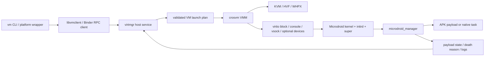
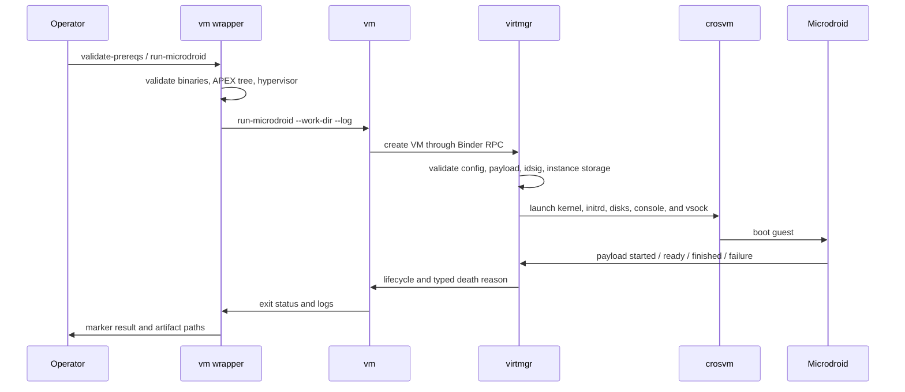
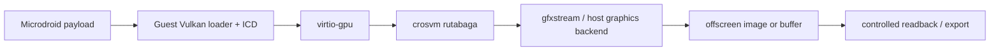

# Microdroid Cross-Platform Implementation

[简体中文](MICRODROID.zh-CN.md) | English

This document is derived from the current build scripts, `packages/modules/Virtualization`,
`crosvm`, host Binder RPC ports, and the three platform regression drivers. It records what the
code implements and checks. Source presence or command-line acceptance is not treated as
production evidence from a target machine.

## 1. Role, Scope, and Status Terms

Microdroid is the primary BSCP guest. It provides a smaller boot and attack surface for running a
described and verified payload; it is not a phone emulator. Full Android/Cuttlefish is an optional
compatibility path described in [Full Android Cross-Platform Implementation](ANDROID.md).

Status terms used below:

- **Reference path**: the primary semantic baseline for control, guest launch, and regression.
- **Implemented**: the current source contains an end-to-end call path and explicit error handling.
- **Gated**: a repeatable regression or marker check exists, but it must run on the target host to
  create evidence.
- **Conditional**: depends on host capabilities, correctly matched artifacts, or an external
  runtime.
- **Not aligned**: no equivalent security semantics exist, or the code rejects the capability.

## 2. Architecture



1. The platform wrapper locates host binaries and the APEX tree, creates instance and log
   directories, and performs prerequisite checks.
2. `vm` parses commands and APK, idsig, instance-image, console, and lifecycle parameters.
3. `virtmgr` validates the request, resolves `com.android.virt` assets, and creates the composite
   disk, CID, and launch plan.
4. `crosvm` maps that plan to KVM, Hypervisor.framework, or WHPX with explicit virtio devices.
5. Guest `microdroid_manager` verifies payload identity, starts the task, and reports readiness,
   completion, or a typed death reason over RPC.

## 3. Guest Assets

The three raw VM configurations have the same structure:

- `scripts/microdroid_linux_raw.json`
- `scripts/microdroid_macos_raw.json`
- `scripts/microdroid_windows_raw.json`

| Asset | APEX path or meaning |
| --- | --- |
| Kernel | `/apex/com.android.virt/etc/fs/microdroid_kernel` |
| Initrd | `microdroid_initrd_debuggable.img` |
| Verified metadata | `microdroid_vbmeta.img`, read-only `vbmeta_a` |
| System payload | `microdroid_super.img`, read-only `super` |
| Memory | 256 MiB by default; upper layers may override it |
| Console | `hvc0` |
| Platform contract | `~1.0` |

`prepare_host_apex_tree.sh` converts product output into desktop-consumable `apex/`, `system/`,
and `system_ext/` trees and refreshes `apex-info-list.xml`. The Windows wrapper also expands CAPEX
`original_apex` content into a deterministic desktop APEX layout. macOS separately rejects a
guest kernel that is not arm64.

## 4. Lifecycle



Persistent `virtmgr` mode stores service state, the PID, control endpoint, and traces under
`VIRTMGR_SERVICE_DIR`. `list`, `console`, `service-status`, and `stop-service` therefore operate on
one continuing service. Linux and macOS use Unix files and sockets; Windows uses per-session named
pipes plus explicit state files.

## 5. Three-Platform Implementation Matrix

| Capability | Linux | macOS | Windows |
| --- | --- | --- | --- |
| Host/guest architecture | x86_64 or arm64; artifacts must match | Apple Silicon/arm64; arm64 guest enforced | x86_64 GNU/MinGW host |
| Hypervisor | KVM, reference path | Hypervisor.framework/HVF | Windows Hypervisor Platform/WHPX |
| Rust target | `x86_64-unknown-linux-gnu` or `aarch64-unknown-linux-gnu` | `aarch64-apple-darwin` | `x86_64-pc-windows-gnu` |
| Guest RPC transport | Native `AF_VSOCK` | crosvm host-connect UDS plus port handshake | `\\.\pipe\binder_rpc_vsock_<cid>_<port>` |
| crosvm control | Unix seqpacket/control socket | Unix stream/control socket | Named-pipe control endpoint |
| Host Binder | CMake `libbinder-rpc.so` plus Rust bindings | `libbinder-rpc.dylib` with Unix-socket compatibility | `libbinder-rpc.dll` with named-pipe transport |
| APEX source | `out/dist/apex_dir` or explicit source | Explicit/prepared arm64 APEX tree | Product APEX/CAPEX desktop tree |
| Core commands | `run-microdroid`, `run-app`, `run`, `info`, `list`, `console` | Linux parity plus `diagnose` and `cleanup` | Command parity through PowerShell parameters |
| Persistent service | Implemented and regression-covered | Implemented and regression-covered | Implemented and regression-covered |
| Console | File or persistent-service PTY | File or persistent-service PTY | File/named-pipe duplex console; separate serial capture |
| Optional ADB bridge | localhost TCP to guest vsock | localhost TCP to UDS-vsock | localhost TCP to named-pipe-vsock |
| Protected VM | Conditional on KVM/pKVM, pvmfw, and host capability; not a default gate | No release proof equivalent to Android pVM | Wrapper explicitly rejects `-Protected` |
| Vulkan offscreen rendering | Host source path ready; graphics profile/guest pending | Host path ready; guest pending | Host source path ready; graphics runtime/guest pending |
| Automated gate | `run_linux_avf_regression.sh` | `run_macos_avf_regression.sh` | `run_windows_avf_regression.ps1` |

### 5.1 Linux/KVM

Linux is the reference implementation. `vm_linux.sh` consumes
`out/dist/linux/bin/{vm,virtmgr,crosvm}` and defaults to `out/dist/apex_dir`. Guest communication
uses real AF_VSOCK; the control socket, PTY, and descriptor passing retain Unix semantics.

The regression covers prerequisites, `info`, partition and idsig creation, a short-lived
Microdroid, optional `run-app`, persistent service startup, CID parsing, `list`, `console`, optional
ADB, and service shutdown. A CID collision rebuilds context up to four times so address reuse is
not reported as a guest semantic failure.

### 5.2 macOS/HVF

macOS accepts Apple Silicon and an arm64 Microdroid kernel. Its build uses the nightly crosvm
toolchain with `hvf`, networking, and audio features, then ad-hoc signs crosvm with the
`com.apple.security.hypervisor` entitlement.

The host has no native AF_VSOCK path here. crosvm publishes a UDS; `virtmgr` connects to the
CID-named host-connect socket and writes the guest port as a handshake. The wrapper checks
`kern.hv_support`, signing entitlement, kernel architecture, and `com.android.adbd` resources.
Smoke and full regression modes check guest readiness, PSCI shutdown, persistent service, and
optional ADB.

### 5.3 Windows/WHPX

Windows uses a pinned GNU host toolchain, MinGW-w64 C/C++, WHPX crosvm, and Binder named-pipe
transports. `vm_windows.ps1` validates Windows Hypervisor Platform/Hyper-V state and
`HypervisorPresent`, prepares the APEX/CAPEX tree, and supplies the `VIRTMGR_*` environment
contract.

The Windows crosvm launch plan rejects VFIO, Unix TAP, and `boost-uclamp`. Duplex console traffic
uses files or named pipes; guest vsock uses `binder_rpc_vsock_<cid>_<port>`. Regression captures
guest console and crosvm stdout/stderr and validates the persistent service, list/console, and
optional ADB. A protected request fails explicitly instead of silently becoming non-protected.

## 6. Payload, Instance, and Storage

### 6.1 `run-microdroid`

This command creates a minimal instance around the APEX EmptyPayload. It verifies the kernel,
initrd, virtio block, vsock, Binder RPC, and lifecycle chain; it does not prove arbitrary
application compatibility.

### 6.2 `run-app`

Inputs include an APK, its idsig, an instance image, and the payload native-library name. The
example library is `MicrodroidEmptyPayloadJniLib.so`. Extra APK declarations, idsigs, and supplied
descriptors must remain one-to-one; configuration strings must not become arbitrary host paths.

### 6.3 Custom VM

`run <config>` accepts explicit JSON for custom kernels, initrds, and disks. This expands the
trusted configuration surface. A release service must pin the schema, artifact source, and allowed
path roots rather than accept untrusted host paths.

### 6.4 Instance State

- `work-dir` contains the run's composite disk, temporary files, and instance state.
- `instance` binds payload identity and persistent VM state and must not be reused across
  incompatible payloads.
- `idsig` is APK integrity side data and should be managed with the APK.
- Writable storage must be private per instance; release source images remain read-only.
- Console, guest log, virtmgr trace, vmclient trace, and crosvm stdio are stored separately.

## 7. Host Abstraction and Source Changes

`desktop_host` separates permission, SELinux, staged APEX, vsock, and debug-policy providers and
adds CPU-count and file-handle path resolution.

| Repository | Main changes |
| --- | --- |
| `packages/modules/Virtualization` | Desktop host abstraction; Windows launcher; macOS/Windows vsock emulation; APEX/CAPEX discovery; persistent virtmgr; console, trace, payload, and death-reason alignment |
| `frameworks/native` | Host Binder RPC CMake build; macOS socket compatibility; Windows named-pipe RPC/vsock; Rust bindings/import library; Win32 OS, thread, and descriptor compatibility |
| `external/crosvm` | KVM baseline; aarch64 HVF VCPU/VM, vmnet, Cocoa, console, and vsock; WHPX interrupt/SMP/serial/named-pipe support; portable block/net/GPU devices |
| `system/core` | Atomic and thread portability required by host builds; guest security semantics remain Android-derived |
| Root repository | Three-platform builds, APEX staging, launch wrappers, regression, logging, and release orchestration |

## 8. Microdroid Vulkan Offscreen-Rendering Readiness

The current implementation status is **host foundation ready; guest enablement pending**. Across
the three hosts, crosvm already provides virtio-gpu, rutabaga/gfxstream, command and resource
transport, synchronization, and the platform graphics backends. Microdroid offscreen rendering can
reuse that implementation without a new host graphics architecture or a windowed display scanout.

“Host ready” means that the source path and build profile exist; it does not mean every default
distribution contains the graphics runtime. macOS enables the graphics build by default. Linux and
Windows releases must use the existing `ENABLE_GFXSTREAM_ANGLE=1` profile or stage matching
prebuilt gfxstream/ANGLE runtime. Once that artifact configuration is present, the remaining code
work is guest-side and no new host backend is required.



The remaining work is concentrated in the Microdroid guest and runtime profile:

- enable and package the Vulkan loader, guest ICD/driver, and required runtime libraries in the
  Microdroid image;
- configure virtio-gpu discovery, device-node access, SELinux/permissions, and required Android
  features or properties;
- select the host's existing GPU capability in the VM profile while retaining a windowless,
  no-scanout execution mode;
- gate `vkEnumeratePhysicalDevices`, device and queue creation, compute or render-to-image,
  synchronization, readback/export, and failure cleanup;
- enforce memory, command-buffer, execution-time, and concurrency quotas, and validate malicious
  shaders, device reset, and VMM/guest failures against the instance boundary.

Microdroid Vulkan should therefore no longer be described as lacking host support. The precise
status is that the host implementation is ready, while guest-image integration and end-to-end
release evidence remain incomplete. It becomes a supported capability only after guest Vulkan API
behavior, offscreen output correctness, cross-platform parity, and security/resource gates pass.

## 9. Security Boundary and Explicit Limitations

Current usable boundaries include a separate guest kernel and memory, explicit virtual devices,
binding of kernel/initrd/super/vbmeta and payload identity, per-instance writable data and control
endpoints, and typed death reasons. Unsupported protected requests must fail; Windows enforces that
at its wrapper.

The following are **not** current cross-platform guarantees:

- Desktop Linux, macOS, and Windows permission and SELinux providers are environment-driven mocks,
  not Android `system_server` plus SELinux policy.
- Both Unix and Windows `virtmgr` crosvm launchers currently pass `--disable-sandbox`; VMM process
  sandboxing is therefore not an established release baseline.
- macOS HVF and Windows WHPX are not Android pKVM/pVM. Without hardware KeyMint, attestation, and a
  production trust chain, they must not be marketed as Android protected VMs.
- The default raw configuration uses a debuggable initrd. Debug shell, ADB, console, and tracing
  require explicit removal or review in a production profile.
- Host bridges should bind only to loopback; broader listeners expose guest services to a larger
  attack surface.

## 10. Build and Run

Linux:

```bash
./build_all.sh
./scripts/vm_linux.sh --command validate-prereqs
./scripts/vm_linux.sh --command run-microdroid
./scripts/run_linux_avf_regression.sh
```

macOS:

```bash
MACOS_AVF_APEX_TREE_SOURCE=/absolute/arm64/apex_tree ./build_all.sh
./scripts/vm_macos.sh --command validate-prereqs
./scripts/vm_macos.sh --command run-microdroid
./scripts/run_macos_avf_regression.sh --scenario-mode smoke
```

Windows:

```powershell
.\build_all.bat
.\scripts\vm_windows.ps1 -Command validate-prereqs
.\scripts\run_microdroid_windows.ps1
.\scripts\run_windows_avf_regression.ps1
```

## 11. Validation Levels

1. **Static**: Shell, PowerShell, Python, Rust/C++ build, links, and prohibited-information scan.
2. **Artifact**: non-empty, correctly targeted `virtmgr`, `vm`, `crosvm`, and Binder RPC libraries.
3. **Prerequisite**: hypervisor, entitlement, APEX tree, guest architecture, and executables.
4. **Boot**: guest kernel, initrd, block, and console markers.
5. **Control**: payload Ready, typed death reason, list/console, and persistent service.
6. **Data**: optional real ADB connection, guest-shell response, and payload output.
7. **Cleanup**: service stop, process exit, and removal of control endpoints and temporary resources.

A marker checker is evidence-evaluation logic, not evidence that it has run. Releases must retain
logs, host facts, artifact digests, and exit status from each target machine.

## 12. Known Alignment Gaps

| Item | Current conclusion |
| --- | --- |
| pVM/protected VM | Conditional on Linux; unverified on macOS; explicitly unsupported on Windows |
| Android SELinux/permission | Desktop providers are mocks/allowlists, not equivalent enforcement |
| crosvm process sandbox | Disabled by current launchers; requires host sandboxing or implementation work |
| VFIO/device assignment | Linux/Android-specific; rejected on Windows and has no macOS equivalent |
| hugepages/uclamp | Platform semantics differ; parameter presence does not establish parity |
| Microdroid Vulkan | Host source path is ready; graphics artifact profile, guest image, and end-to-end gates need confirmation |
| Production certification | Requires signed artifacts, hardware capabilities, keys/attestation, and target-host evidence |

## 13. Code Entry Points

- Builds: [build_all.sh](../build_all.sh), [build_all.bat](../build_all.bat)
- Linux wrapper: [vm_linux.sh](../scripts/vm_linux.sh)
- macOS wrapper: [vm_macos.sh](../scripts/vm_macos.sh)
- Windows wrapper: [vm_windows.ps1](../scripts/vm_windows.ps1)
- Raw guest config: [microdroid_linux_raw.json](../scripts/microdroid_linux_raw.json)
- Host abstraction: `packages/modules/Virtualization/libs/desktop_host/`
- VMM launch: `packages/modules/Virtualization/android/virtmgr/src/crosvm/`
- Vsock transport: `packages/modules/Virtualization/android/virtmgr/src/vsock_transport.rs`
- Regression: [run_linux_avf_regression.sh](../scripts/run_linux_avf_regression.sh),
  [run_macos_avf_regression.sh](../scripts/run_macos_avf_regression.sh), and
  [run_windows_avf_regression.ps1](../scripts/run_windows_avf_regression.ps1)
