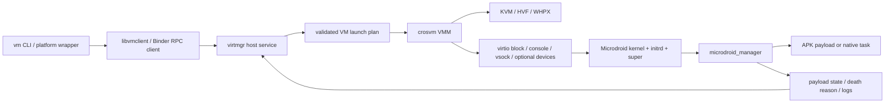
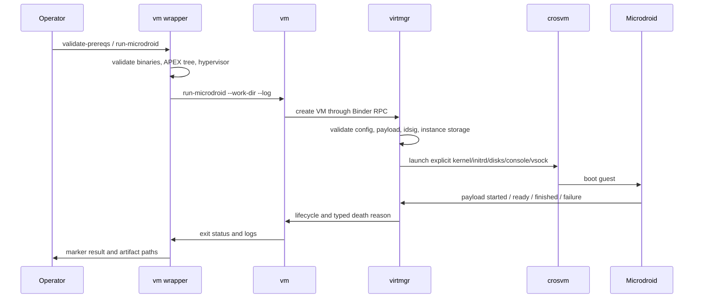

# Microdroid 跨平台实现详解

简体中文 | [English](MICRODROID.md)

本文依据当前仓库中的构建脚本、`packages/modules/Virtualization`、`crosvm`、Binder RPC
适配和三平台回归脚本整理。它描述“代码当前实现了什么、如何实现、由什么检查”，不把代码
存在或参数可解析等同于目标机器上的生产认证。

## 1. 定位、范围与状态定义

Microdroid 是 BSCP 的首要 Guest。它提供比完整 Android 更小的启动面，用于运行经过描述和
校验的 Payload，而不是模拟手机。完整 Android/Cuttlefish 是附带兼容路径，参见
[完整 Android 跨平台实现详解](ANDROID.zh-CN.md)。

本文使用以下状态：

- **参考路径**：控制面、Guest 启动和回归脚本以此平台为主要语义基准。
- **已实现**：当前源码存在完整调用链和明确错误处理。
- **有门禁**：仓库提供可重复的回归或 marker 检查；仍需在对应主机执行才能产生运行证据。
- **条件支持**：依赖主机能力、正确架构制品或外部运行时。
- **未对齐**：三平台没有等价安全语义，或代码明确拒绝。

## 2. 总体架构



各层职责如下：

1. 平台包装脚本定位 host 二进制、APEX 树、日志目录和实例目录，并执行前置检查。
2. `vm` 负责命令解析、APK/idsig/实例镜像参数、控制台和生命周期操作。
3. `virtmgr` 校验配置，解析 `com.android.virt` 资源，创建 composite disk、CID 和启动计划。
4. `crosvm` 将统一计划映射到 KVM、Hypervisor.framework 或 WHPX，并创建显式 virtio 设备。
5. Guest 内 `microdroid_manager` 校验 Payload 身份、启动任务，并通过 RPC 回报 Ready、完成或死亡原因。

## 3. Guest 启动资源

仓库提供三份结构相同的 raw VM 配置：

- `scripts/microdroid_linux_raw.json`
- `scripts/microdroid_macos_raw.json`
- `scripts/microdroid_windows_raw.json`

默认配置包含：

| 资源 | APEX 内路径/含义 |
| --- | --- |
| Kernel | `/apex/com.android.virt/etc/fs/microdroid_kernel` |
| Initrd | `microdroid_initrd_debuggable.img` |
| Verified metadata | `microdroid_vbmeta.img`，作为只读 `vbmeta_a` 分区 |
| System payload | `microdroid_super.img`，作为只读 `super` 分区 |
| Memory | 256 MiB 默认值，可由上层配置覆盖 |
| Console | `hvc0` |
| Platform contract | `~1.0` |

`prepare_host_apex_tree.sh` 将 product 输出整理为桌面主机可消费的 `apex/`、`system/`、
`system_ext/` 结构，并生成/刷新 `apex-info-list.xml`。Windows 包装器还会处理 CAPEX 的
`original_apex`，为桌面端构造确定性的解压 APEX 布局。macOS 会额外校验 Guest kernel 必须
是 arm64。

## 4. 生命周期与数据流



持久 `virtmgr` 模式通过 `VIRTMGR_SERVICE_DIR` 保存 service state、PID、控制端点和 trace。
`list`、`console`、`service-status` 与 `stop-service` 因而可连接同一服务，而不是每次启动一套
无关联的进程。Linux/macOS 使用 Unix 文件与 socket；Windows 使用当前会话内的 named pipe
及显式状态文件。

## 5. 三平台实现矩阵

| 能力 | Linux | macOS | Windows |
| --- | --- | --- | --- |
| 主机/Guest 架构 | x86_64 或 arm64，Guest 必须匹配制品 | Apple Silicon/arm64，强制 arm64 Guest kernel | x86_64，GNU Rust/MinGW host |
| Hypervisor | KVM，参考路径 | Hypervisor.framework/HVF | Windows Hypervisor Platform/WHPX |
| 构建 target | `x86_64-unknown-linux-gnu` 或 `aarch64-unknown-linux-gnu` | `aarch64-apple-darwin` | `x86_64-pc-windows-gnu` |
| Guest RPC transport | 原生 `AF_VSOCK` | crosvm host-connect UDS + 端口握手 | `\\.\pipe\binder_rpc_vsock_<cid>_<port>` |
| crosvm control | Unix seqpacket/control socket | Unix stream/control socket | named-pipe control endpoint |
| Host Binder | CMake `libbinder-rpc.so` + Rust bindings | `libbinder-rpc.dylib` + Unix socket 兼容 | `libbinder-rpc.dll` + named-pipe transport |
| APEX 来源 | `out/dist/apex_dir` 或显式 source | 必须显式提供/准备 arm64 APEX 树 | product APEX/CAPEX 组成的桌面树 |
| 基本命令 | `run-microdroid`、`run-app`、`run`、`info`、`list`、`console` | 与 Linux 对齐，另有 `diagnose`、`cleanup` | 与 Linux 对齐，PowerShell 参数模型 |
| 持久服务 | 已实现并有回归流程 | 已实现并有回归流程 | 已实现并有回归流程 |
| Console | 文件或持久服务 PTY | 文件或持久服务 PTY | 文件/named-pipe 双向控制台，可抓取独立串口 |
| ADB bridge | 可选 localhost TCP→Guest vsock | 可选 localhost TCP→UDS-vsock | 可选 localhost TCP→named-pipe-vsock |
| Protected VM | 取决于 KVM/pKVM、pvmfw 与 host capability；非默认门禁 | 没有与 Android pVM 等价的发布证明 | 包装器明确拒绝 `-Protected` |
| 图形 | Microdroid 基线无图形；自定义 VM 可请求 GPU | 基线无图形 | 基线无图形 |
| 自动门禁 | `run_linux_avf_regression.sh` | `run_macos_avf_regression.sh` | `run_windows_avf_regression.ps1` |

### 5.1 Linux/KVM

Linux 是参考实现。`vm_linux.sh` 使用 `out/dist/linux/bin/{vm,virtmgr,crosvm}`，APEX 根默认为
`out/dist/apex_dir`。Guest 通信使用真实 AF_VSOCK；control socket、PTY 和文件描述符传递均
使用 Unix 语义。

回归流程覆盖前置检查、`info`、分区创建、idsig 创建、短生命周期 Microdroid、可选
`run-app`、持久服务、CID 解析、`list`、`console`、可选 ADB 和服务停止。CID 冲突时最多
重建四次上下文，不把地址占用误判为 Guest 语义失败。

### 5.2 macOS/HVF

macOS 只接受 Apple Silicon 与 arm64 Microdroid kernel。构建脚本使用 nightly crosvm
toolchain，启用 `hvf`、`net`、`audio` 等 feature，并对 crosvm 做带
`com.apple.security.hypervisor` entitlement 的 ad-hoc 签名。

Guest vsock 不是主机原生 AF_VSOCK：crosvm 暴露 UDS，`virtmgr` 先连接按 CID 命名的
host-connect socket，再写入 Guest port 进行桥接。包装器检查 `kern.hv_support`、签名
entitlement、arm64 kernel 和 `com.android.adbd` 资源。回归提供 smoke/full 两种模式，并
检查 Guest Ready、PSCI 关机、持久服务和可选 ADB。

### 5.3 Windows/WHPX

Windows 使用固定 GNU host toolchain、MinGW-w64 C/C++、WHPX crosvm 和 Binder named-pipe
传输。`vm_windows.ps1` 检查 HypervisorPlatform/Hyper-V 状态和 `HypervisorPresent`，准备
APEX/CAPEX 目录，并设置 `VIRTMGR_*` 环境契约。

Windows crosvm 启动计划主动拒绝 VFIO、Unix TAP 和 `boost-uclamp`。双向 console 通过文件
或 named pipe 传递；Guest vsock 用 `binder_rpc_vsock_<cid>_<port>` 命名。回归会抓取 Guest
console 和 crosvm stdout/stderr，验证持久服务、list/console 与可选 ADB。Protected VM 在
包装层明确失败，不能静默退化成 non-protected VM。

## 6. Payload、实例与存储

### 6.1 `run-microdroid`

使用 APEX 中的 EmptyPayload 构造最小可运行实例，适合验证 Kernel、initrd、virtio block、
vsock、Binder RPC 和生命周期链。它验证基础设施，不代表任意业务 Payload 已兼容。

### 6.2 `run-app`

输入包括 APK、APK idsig、实例镜像和 Payload native library 名。默认示例是
`MicrodroidEmptyPayloadJniLib.so`。`vm` 创建或使用 idsig，`virtmgr` 从签名 Payload 配置
派生 Guest 任务。额外 APK 必须保持配置声明、idsig 和调用者提供描述符的一一对应，不能
通过配置字符串开放任意 host 路径。

### 6.3 Custom VM

`run <config>` 接收显式 JSON 配置，适合内核/initrd/磁盘自定义。它扩大了受信配置面，发布
系统必须固定 schema、文件来源和路径根，不能直接接受不可信用户提供的 host path。

### 6.4 实例状态

- `work-dir`：每次运行的 composite disk、临时文件和实例状态。
- `instance`：Payload 身份与持久 VM 状态，不能跨不相容 Payload 复用。
- `idsig`：APK 完整性辅助数据，应与 APK 一起管理。
- 可写存储：必须为每实例独立分配；发布源镜像保持只读。
- 日志：console、Guest log、virtmgr trace、vmclient trace 和 crosvm stdio 分开保存。

## 7. Host 抽象与跨平台修改

`desktop_host` 将平台差异拆成五个能力接口：Permission、SELinux、staged APEX、vsock 和
debug policy，并提供 CPU 数与文件句柄路径解析。主要修改分布如下：

| 仓库 | 主要修改 |
| --- | --- |
| `packages/modules/Virtualization` | 桌面 host abstraction；Windows crosvm launcher；macOS/Windows vsock 仿真；APEX/CAPEX discovery；持久 virtmgr；console、trace、Payload 与 death reason 对齐 |
| `frameworks/native` | Host Binder RPC CMake 构建；macOS socket 兼容；Windows named-pipe RPC/vsock；Rust bindgen/import library；Win32 OS/thread/fd 兼容层 |
| `external/crosvm` | KVM 基线；HVF aarch64 VCPU/VM、vmnet、Cocoa/console/vsock；WHPX 中断、SMP、串口与 named pipe；跨平台 block/net/gpu 设备 |
| `system/core` | Host 构建所需 atomic/thread portability，Guest 安全语义仍以 Android 基线为准 |
| 根仓库 | 三平台构建、APEX staging、运行包装、回归、日志和发布编排 |

## 8. 安全边界与必须明确的限制

### 8.1 当前可依赖的边界

- Guest 使用独立 kernel、内存和显式虚拟设备。
- Kernel/initrd/super/vbmeta 和 Payload 身份在启动计划中明确绑定。
- 实例可写数据、日志与控制端点可分目录隔离。
- Protected 请求在不能满足时应失败；Windows 已在 wrapper 中强制这一行为。
- typed death reason 区分 Payload 变化、验证失败、无效配置、连接失败、VMM crash 与正常关机。

### 8.2 当前不能宣称的保证

- 桌面 Linux、macOS 和 Windows 的 Permission/SELinux provider 当前是环境驱动的 mock，
  不等价于 Android system_server + SELinux policy。
- `virtmgr` 的 Unix 与 Windows crosvm launcher 当前都传入 `--disable-sandbox`；因此 VMM
  进程沙箱不是当前跨平台发布基线的既成保证。
- macOS HVF 与 Windows WHPX 不等价于 Android pKVM/pVM；没有硬件 KeyMint、远程证明和
  生产信任链时，不得宣传为 Android protected VM。
- 默认 raw 配置使用 debuggable initrd。调试 shell、ADB、console 和 trace 必须在生产
  profile 中显式关闭或重新审查。
- Host bridge 只应绑定 loopback；扩大监听地址会扩大 Guest 服务攻击面。

## 9. 构建与运行

Linux：

```bash
./build_all.sh
./scripts/vm_linux.sh --command validate-prereqs
./scripts/vm_linux.sh --command run-microdroid
./scripts/run_linux_avf_regression.sh
```

macOS：

```bash
MACOS_AVF_APEX_TREE_SOURCE=/absolute/arm64/apex_tree ./build_all.sh
./scripts/vm_macos.sh --command validate-prereqs
./scripts/vm_macos.sh --command run-microdroid
./scripts/run_macos_avf_regression.sh --scenario-mode smoke
```

Windows：

```powershell
.\build_all.bat
.\scripts\vm_windows.ps1 -Command validate-prereqs
.\scripts\run_microdroid_windows.ps1
.\scripts\run_windows_avf_regression.ps1
```

## 10. 验证层级

1. **静态层**：Shell/PowerShell/Python 语法、Rust/C++ 编译、文档链接与禁止信息扫描。
2. **产物层**：`virtmgr`、`vm`、`crosvm`、Binder RPC 动态库非空且架构正确。
3. **前置层**：Hypervisor、entitlement、APEX 树、Guest kernel 架构和可执行文件。
4. **启动层**：Guest kernel、initrd、block 和 console marker。
5. **控制层**：Payload Ready、typed death reason、list/console、持久 service。
6. **数据层**：可选 ADB 实际连接、Guest shell 回读和 Payload 输出。
7. **清理层**：服务停止、进程退出、控制端点与临时资源回收。

仓库中的 marker checker 是证据判定逻辑，不是已经执行的证据。发布时必须保存目标机器上
本次运行产生的日志、主机信息、制品摘要和退出状态。

## 11. 已知未对齐项

| 项目 | 当前结论 |
| --- | --- |
| pVM/protected VM | Linux 条件能力；macOS 未认证；Windows 明确不支持 |
| Android SELinux/Permission | 桌面 host 使用 mock/allowlist，不是等价实现 |
| crosvm process sandbox | 当前 launcher 禁用，需额外 host sandbox 或后续实现 |
| VFIO/device assignment | Linux/Android 专属；Windows launcher 拒绝，macOS 无等价路径 |
| hugepages/uclamp | 平台语义不同，不能只凭参数存在声明对齐 |
| Microdroid 图形 | 非默认目标；完整 Android 图形路径单独维护 |
| 生产认证 | 需要签名制品、硬件能力、密钥/证明链和平台实机证据 |

## 12. 关键代码入口

- 构建：[build_all.sh](../build_all.sh)、[build_all.bat](../build_all.bat)
- Linux：[vm_linux.sh](../scripts/vm_linux.sh)
- macOS：[vm_macos.sh](../scripts/vm_macos.sh)
- Windows：[vm_windows.ps1](../scripts/vm_windows.ps1)
- Guest raw 配置：[microdroid_linux_raw.json](../scripts/microdroid_linux_raw.json)
- Host abstraction：`packages/modules/Virtualization/libs/desktop_host/`
- VMM launch：`packages/modules/Virtualization/android/virtmgr/src/crosvm/`
- Vsock transport：`packages/modules/Virtualization/android/virtmgr/src/vsock_transport.rs`
- 回归：[run_linux_avf_regression.sh](../scripts/run_linux_avf_regression.sh)、
  [run_macos_avf_regression.sh](../scripts/run_macos_avf_regression.sh)、
  [run_windows_avf_regression.ps1](../scripts/run_windows_avf_regression.ps1)
